# Layer 12: Infrastructure — Deep Dive

> Explained like you're 12 years old, with full git history evolution.

---

## What Is the Infrastructure Layer? (The Simple Version)

Imagine you've built an amazing robot (OpenClaw). It can think, talk, and do things. But now you need to figure out: **where does this robot live?** How does it turn on when you start your computer? How do you put it in a box (container) so it runs the same way everywhere? And how do you keep it safe from bad actors?

That's what the Infrastructure layer does:

1. **Docker** — Puts OpenClaw in a container (like a shipping container for software) so it runs identically everywhere
2. **Daemon** — Makes OpenClaw start automatically when your computer boots, like a background service
3. **Sandbox** — Puts the AI's code execution in a locked room (isolated container) so it can't break your system
4. **Tailscale** — Lets you securely access OpenClaw from anywhere using a private mesh network
5. **Cloud Deployments** — One-click deployment to Fly.io, Render, or Kubernetes

Think of it like building a house for the robot: Docker is the prefab house, the daemon is the alarm clock that wakes it up every morning, the sandbox is a padded playroom where it can experiment safely, and Tailscale is a secure tunnel connecting the house to the outside world.

---

## Part 1: Docker — The Container System

### The Main Dockerfile

**File:** `Dockerfile` (249 lines)

The Dockerfile builds the OpenClaw container in multiple stages, like an assembly line:

#### Stage 1: ext-deps (Extension Dependencies)
Extracts only `package.json` files from opted-in extensions. This prevents rebuilding the entire image when only extension source code changes (not their dependencies).

#### Stage 2: build
The heavy lifting stage:
1. **Install Bun** with 5-attempt retry logic (network failures happen)
2. **Enable corepack** for pnpm package management
3. **Install dependencies** via pnpm with aggressive caching:
   - Cache mount: `openclaw-pnpm-store` (persists across builds)
   - `NODE_OPTIONS=--max-old-space-size=2048` (prevents OOM on small hosts)
4. **Normalize permissions** for extensions and agent directories
5. **Bundle A2UI** (with stub fallback if sources missing)
6. **Build all TypeScript** → JavaScript

#### Stage 3: runtime-assets
Prunes development dependencies and removes TypeScript declaration files (`.d.ts`, `.d.mts`, `.map`) — they're not needed at runtime.

#### Stage 4: Runtime Base Selection
Two variants:
- **default** (`node:24-bookworm`, ~900MB) — full Debian with all tools
- **slim** (`node:24-bookworm-slim`, ~300MB) — minimal Debian

Both use **SHA256-pinned digests** for reproducible builds — the exact same base image every time.

#### Stage 5: Final Runtime
Assembles the production image:

**System packages:** `procps`, `hostname`, `curl`, `git`, `openssl` (with apt cache mounts for fast rebuilds)

**Artifact copy** (as non-root `node` user):
- `dist/` — compiled JavaScript
- `node_modules/` — production dependencies only
- `extensions/` — channel and plugin extensions
- `skills/` — AI skill documentation
- `docs/` — documentation

**Corepack persistence:** Installs pnpm into a shared directory so it survives container restarts.

**Optional features** (build args):
- `OPENCLAW_INSTALL_BROWSER` — adds Chromium + Xvfb (~300MB extra) for browser automation
- `OPENCLAW_INSTALL_DOCKER_CLI` — adds Docker CLI (~50MB) for sandbox management. Validates the GPG key fingerprint before trusting it.

**Security hardening:**
- Runs as non-root `node` user (UID 1000)
- `NODE_ENV=production`
- Symlinks CLI to `/usr/local/bin/openclaw`

**Healthcheck:**
```dockerfile
HEALTHCHECK --interval=3m --timeout=10s --start-period=15s --retries=3 \
  CMD node -e "fetch('http://127.0.0.1:18789/healthz').then(r=>process.exit(r.ok?0:1)).catch(()=>process.exit(1))"
```

**Default command:** `node openclaw.mjs gateway --allow-unconfigured`

### Sandbox Dockerfiles

Three additional Dockerfiles for isolated code execution:

**Dockerfile.sandbox** — Basic sandbox:
- Debian bookworm-slim with bash, curl, git, jq, python3, ripgrep
- Non-root `sandbox` user
- CMD: `sleep infinity` (kept alive, commands run via `docker exec`)

**Dockerfile.sandbox-browser** — Browser sandbox:
- Adds Chromium, fonts, noVNC, Xvfb, x11vnc, websockify
- Exposes ports: 9222 (Chrome DevTools), 5900 (VNC), 6080 (noVNC web)
- Custom entrypoint script

**Dockerfile.sandbox-common** — Full development environment:
- Build arg controlled installations:
  - Packages: curl, wget, nodejs, npm, python3, git, golang, rustc, cargo, build-essential
  - Optional: pnpm, Bun, Homebrew (Linux)
- Used for agents that need to compile code

### Docker Compose

**File:** `docker-compose.yml` (79 lines)

Two services:

**openclaw-gateway:**
```yaml
image: ${OPENCLAW_IMAGE:-openclaw:local}
ports:
  - "${OPENCLAW_GATEWAY_PORT:-18789}:18789"  # Gateway
  - "${OPENCLAW_BRIDGE_PORT:-18790}:18790"    # Bridge
volumes:
  - ${OPENCLAW_CONFIG_DIR}:/home/node/.openclaw
  - ${OPENCLAW_WORKSPACE_DIR}:/home/node/.openclaw/workspace
restart: unless-stopped
init: true
healthcheck:
  test: fetch /healthz (interval: 30s, timeout: 5s, retries: 5)
```

**openclaw-cli:**
```yaml
network_mode: "service:openclaw-gateway"  # Shared network namespace
cap_drop: [NET_RAW, NET_ADMIN]            # Security restriction
security_opt: ["no-new-privileges:true"]  # Can't escalate
stdin_open: true                          # Interactive
tty: true
```

### Docker Setup Script

**File:** `docker-setup.sh` (617 lines)

An interactive setup wizard that:

1. **Validates dependencies** — requires Docker and Docker Compose v2
2. **Sets up directories** — creates `~/.openclaw/`, `identity/`, `agents/main/`, `sessions/`
3. **Manages tokens** — generates `OPENCLAW_GATEWAY_TOKEN` via `openssl rand -hex 32` (or Python fallback)
4. **Token priority**: existing config → `.env` file → generate new
5. **Builds or pulls** the Docker image
6. **Fixes permissions** — runs as root to chown `/home/node/.openclaw`
7. **Runs onboarding** interactively
8. **Optionally sets up sandbox** — builds sandbox image, mounts Docker socket, configures sandbox mode
9. **Starts the gateway** — `docker compose up -d openclaw-gateway`

**Security features:**
- Validates mount paths (no control chars, no whitespace)
- Validates timezone against `/usr/share/zoneinfo/`
- Token stored in config file, not in compose file
- Named volume validation with strict regex

### Health Endpoints

**In the gateway (`server-http.ts`):**

| Path | Type | Behavior |
|------|------|----------|
| `/health`, `/healthz` | Liveness | Always returns 200 `{ ok: true, status: "live" }` |
| `/ready`, `/readyz` | Readiness | Returns 200 if ready, 503 if not. Includes details (channels, agents, sessions) for authenticated/local requests |

---

## Part 2: The Daemon System — Auto-Start on Boot

**Directory:** `src/daemon/` (52 files)

The daemon system makes OpenClaw start automatically when your computer boots and restart if it crashes. It supports three platforms:

### Platform Detection

```typescript
// service.ts
const PLATFORM_REGISTRY = {
  darwin: LaunchdService,   // macOS
  linux: SystemdService,    // Linux
  win32: SchtasksService,   // Windows
};
```

### The GatewayService Interface

Every platform implements:
```typescript
type GatewayService = {
  install(args): Promise<void>;
  uninstall(args): Promise<void>;
  restart(args): Promise<GatewayServiceRestartResult>;
  readCommand(env): Promise<GatewayServiceCommandConfig | null>;
  readRuntime(env): Promise<GatewayServiceRuntime>;
  isLoaded(args): Promise<boolean>;
};
```

### macOS: LaunchAgent (launchd)

**File:** `src/daemon/launchd.ts` (542 lines)

LaunchAgents are macOS's way of running background services for a user.

**Installation:**
1. Ensure secure directories (mode 0o755)
2. Remove any legacy agents (from clawdbot/moltbot era)
3. Generate a `.plist` XML file
4. `launchctl enable gui/$UID/ai.openclaw.gateway`
5. `launchctl bootstrap gui/$UID /path/to/plist`

**Plist generation (`launchd-plist.ts`):**
```xml
<plist>
  <dict>
    <key>Label</key><string>ai.openclaw.gateway</string>
    <key>RunAtLoad</key><true/>           <!-- Start on login -->
    <key>KeepAlive</key><true/>           <!-- Restart on crash -->
    <key>ThrottleInterval</key><integer>1</integer>  <!-- Min 1s between restarts -->
    <key>Umask</key><integer>63</integer> <!-- 0o077 — owner-only files -->
    <key>ProgramArguments</key><array>
      <string>/usr/local/bin/node</string>
      <string>/path/to/dist/index.js</string>
      <string>gateway</string>
    </array>
    <key>StandardOutPath</key><string>~/.openclaw/logs/gateway.log</string>
    <key>StandardErrorPath</key><string>~/.openclaw/logs/gateway.err.log</string>
  </dict>
</plist>
```

**Restart trick (`launchd-restart-handoff.ts`):**
When the service process restarts itself, it can't use `launchctl kickstart` directly (it would kill itself first). Instead, it spawns a **detached shell script** that:
1. Waits for the parent PID to exit
2. Runs `launchctl kickstart -k gui/$UID/ai.openclaw.gateway`
3. Falls back to `launchctl bootstrap` if kickstart fails

### Linux: systemd User Service

**File:** `src/daemon/systemd.ts` (300+ lines)

**Unit file generation (`systemd-unit.ts`):**
```ini
[Unit]
Description=OpenClaw Gateway
After=network-online.target
Wants=network-online.target

[Service]
ExecStart=/usr/local/bin/node /path/to/dist/index.js gateway --port 18789
Restart=always
RestartSec=5
TimeoutStopSec=30
TimeoutStartSec=30
SuccessExitStatus=0 143
KillMode=control-group
WorkingDirectory=/path/to/openclaw
Environment=PATH=/usr/local/bin:/usr/bin:/bin

[Install]
WantedBy=default.target
```

**Unit file path:** `~/.config/systemd/user/openclaw-gateway.service`

**Linger mode (`systemd-linger.ts`):**
By default, systemd user services only run while the user has an active login session. `loginctl enable-linger` makes them persistent — the service runs even after logout. The daemon detects if sudo is needed and prompts accordingly.

**WSL2 detection (`systemd-hints.ts`):**
WSL2 needs systemd enabled via `/etc/wsl.conf [boot]systemd=true`. The daemon detects this and provides instructions. It also detects container environments (no systemd available) and suggests foreground mode instead.

### Windows: Task Scheduler (schtasks)

**File:** `src/daemon/schtasks.ts` (400+ lines)

Windows uses Task Scheduler for background services:

**Task script generation:**
```batch
@echo off
REM OpenClaw Gateway Service
cd /d C:\path\to\openclaw
SET OPENCLAW_GATEWAY_TOKEN=abc123
node dist\index.js gateway --port 18789
```

**Startup fallback:** If `schtasks /Create` fails (permission issues, timeout), it creates a startup launcher in the user's Startup folder instead — a `.cmd` file that runs `start "" /min cmd.exe /d /c gateway-script.cmd`.

**Important:** Windows doesn't override PATH — it inherits the Task Scheduler's PATH, unlike macOS/Linux where a minimal explicit PATH is set.

### Environment Resolution

**File:** `src/daemon/service-env.ts` (340 lines)

The daemon builds a minimal, secure PATH for each platform:

**macOS:**
- fnm: `~/Library/Application Support/fnm/aliases/default/bin`
- pnpm: `~/Library/pnpm`
- System: `/opt/homebrew/bin`, `/usr/local/bin`, `/usr/bin`, `/bin`
- Extra: `NODE_EXTRA_CA_CERTS=/etc/ssl/cert.pem`, `NODE_USE_SYSTEM_CA=1`

**Linux:**
- fnm: `~/.fnm/current/bin`
- nvm: `~/.nvm/current/bin`
- pnpm: `~/.local/share/pnpm`
- System: `/usr/local/bin`, `/usr/bin`, `/bin`

**Windows:**
- Inherits Task Scheduler PATH (no override)

### Service Auditing

**File:** `src/daemon/service-audit.ts` (424 lines)

The audit system checks installed services for common issues:

- **Token drift** — service has a different token than config (stale)
- **Embedded tokens** — tokens should be in environment files, not plist/unit files
- **PATH validation** — detects version-manager paths that could break on updates
- **Runtime check** — verifies Node version (22.16+ or 24 required)
- **Gateway command** — ensures "gateway" subcommand is present
- **Platform-specific**: Linux checks `After=network-online.target`, macOS checks `RunAtLoad=true`

### Legacy Support

The daemon handles migration from previous project names:

```typescript
LEGACY_GATEWAY_SYSTEMD_SERVICE_NAMES = ["clawdbot-gateway", "moltbot-gateway"]
// Plus legacy launchd labels and Windows task names
```

Old services are automatically detected, cleaned up, and replaced.

### Profile Support

Multiple gateway instances can run with profiles:
- Default: `ai.openclaw.gateway` / `openclaw-gateway.service`
- Profile: `ai.openclaw.myprofile` / `openclaw-gateway-myprofile.service`

---

## Part 3: The Sandbox — Isolated Code Execution

**Directory:** `src/agents/sandbox/` (52 files)

When the AI runs code (bash commands, Python scripts, etc.), you might not want it running directly on your machine. The sandbox puts code execution inside a Docker container — an isolated environment where the AI can't accidentally (or maliciously) damage your system.

### Sandbox Configuration

**File:** `src/agents/sandbox/config.ts` (217 lines)

```typescript
type SandboxConfig = {
  mode: "off" | "non-main" | "all";     // When to sandbox
  scope: "session" | "agent" | "shared"; // Container per-session, per-agent, or shared
  docker: SandboxDockerConfig;           // Container settings
  browser: SandboxBrowserConfig;         // Browser container
  tools: SandboxToolPolicy;              // Tool allow/deny
  prune: SandboxPruneConfig;             // Cleanup rules
};
```

**Mode:**
- `off` — no sandboxing
- `non-main` — sandbox everything except the main agent
- `all` — sandbox everything

**Scope:**
- `session` — fresh container per conversation session
- `agent` — one container per agent (reused across sessions)
- `shared` — single container for all agents

### Docker Container Defaults

```typescript
DEFAULT_SANDBOX_IMAGE = "openclaw-sandbox:bookworm-slim"
containerPrefix = "openclaw-sbx-"
workdir = "/workspace"
readOnlyRoot = true        // Root filesystem is read-only
capDrop = ["ALL"]          // Drop ALL Linux capabilities
tmpfs = ["/tmp", "/var/tmp", "/run"]  // Ephemeral scratch space
network = "none"           // No network by default
pidsLimit = 256            // Max 256 processes
memory = "1g"              // 1GB RAM limit
memorySwap = "2g"          // 2GB total (1GB RAM + 1GB swap)
cpus = 1                   // 1 CPU core
```

### Tool Policy

**File:** `src/agents/sandbox/tool-policy.ts` (110 lines)

Controls which tools the AI can use inside the sandbox:

**Default allow:** exec, process, read, write, edit, apply_patch, image, sessions_*, subagents, session_status

**Default deny:** browser, canvas, nodes, cron, gateway, discord, telegram, whatsapp, slack, signal, imessage (all channel IDs)

Deny always wins over allow. Glob patterns are supported. The AI agent config can override per-agent.

### Security Validation

**File:** `src/agents/sandbox/validate-sandbox-security.ts` (200+ lines)

**Blocked host paths** (never mountable):
- `/etc`, `/proc`, `/sys`, `/dev`, `/root`, `/boot` — OS critical
- `/run`, `/var/run`, `/var/run/docker.sock` — Docker socket escape vectors
- `/private/etc`, `/private/var/run` — macOS equivalents

**Network mode restrictions:**
- `host` — always blocked (escapes to host network)
- `container:*` — blocked unless explicitly allowed (namespace join)
- Default: `none` (complete network isolation)

**Reserved container targets:**
- `/workspace` and `/agent` can't be overridden by bind mounts

### Environment Sanitization

**File:** `src/agents/sandbox/sanitize-env-vars.ts` (111 lines)

Prevents leaking secrets into sandbox containers:

**Always blocked:**
- `ANTHROPIC_API_KEY`, `OPENAI_API_KEY`, `GEMINI_API_KEY`
- `TELEGRAM_BOT_TOKEN`, `DISCORD_BOT_TOKEN`, `SLACK_*_TOKEN`
- `AWS_SECRET_ACCESS_KEY`, `AWS_SESSION_TOKEN`
- `GH_TOKEN`, `GITHUB_TOKEN`
- Catch-alls: `*_API_KEY`, `*_TOKEN`, `*_PASSWORD`, `*_PRIVATE_KEY`, `*_SECRET`

**Always allowed:** `LANG`, `LC_*`, `PATH`, `HOME`, `USER`, `SHELL`, `TERM`, `TZ`, `NODE_ENV`

**Value validation:**
- Rejects null bytes
- Max 32KB per value
- Detects base64-like credential patterns (80+ alphanumeric chars)

### Filesystem Bridge

**File:** `src/agents/sandbox/fs-bridge.ts` (200+ lines)

When the AI reads/writes files from inside the sandbox, the filesystem bridge translates between host and container paths:

```typescript
type SandboxFsBridge = {
  resolvePath(filePath, cwd?): SandboxResolvedPath;  // host ↔ container path mapping
  readFile(filePath, cwd?): Promise<Buffer>;          // Read via docker exec
  writeFile(filePath, data): Promise<void>;           // Write via docker stdin
  stat(filePath): Promise<SandboxFsStat | null>;      // File info
  mkdirp(filePath): Promise<void>;                    // Create directories
  remove(filePath): Promise<void>;                    // Delete files
  rename(old, new): Promise<void>;                    // Move files
};
```

All operations validate path safety before execution — no escaping the sandbox.

### Workspace Access Modes

| Mode | Description |
|------|-------------|
| `none` | No workspace visible inside container |
| `ro` | Read-only access to sandbox workspace |
| `rw` | Read-write access to agent workspace |

### Browser Sandbox

**File:** `src/agents/sandbox/browser.ts` (250+ lines)

A separate container for browser automation (Chromium + noVNC):

- **Image:** `openclaw-sandbox-browser:bookworm-slim`
- **Ports:** CDP (9222), VNC (5900), noVNC web (6080)
- **Network:** Separate `openclaw-sandbox-browser` Docker network
- **CDP waiting:** Polls `http://127.0.0.1:{port}/json/version` until ready
- **noVNC auth:** Random password generated for web VNC access
- **Config hash matching:** Detects when config changes require container recreation

### Container Registry

**File:** `src/agents/sandbox/registry.ts` (187 lines)

Tracks running sandbox containers in JSON files:
- `~/.openclaw/sandbox/containers.json` — sandbox containers
- `~/.openclaw/sandbox/browsers.json` — browser containers

Atomic updates with write locks prevent corruption. Each entry tracks: containerName, sessionKey, createdAt, lastUsedAt, image, configHash.

### Container Pruning

**File:** `src/agents/sandbox/prune.ts` (112 lines)

Automatic cleanup of stale containers:
- **Idle threshold:** 24 hours since last use
- **Max age:** 7 days since creation
- **Check interval:** Every 5 minutes
- Removes containers and updates registry atomically

---

## Part 4: Tailscale Integration — Secure Remote Access

**Files:** `src/infra/tailscale.ts` (300+ lines), `src/shared/tailscale-status.ts` (71 lines)

Tailscale creates a secure mesh network between your devices. OpenClaw uses it for remote gateway access without exposing ports to the internet.

### Binary Discovery

The system searches for Tailscale in multiple locations:
1. `which tailscale` (standard PATH)
2. `/Applications/Tailscale.app/Contents/MacOS/Tailscale` (macOS app)
3. `find /Applications` for Tailscale.app
4. `locate Tailscale.app`

Each candidate is verified with `tailscale --version` (3s timeout). The result is cached.

### Tailnet Hostname

Reads `tailscale status --json`, parses `Self.DNSName` (your hostname on the tailnet). Falls back to the first `Self.TailscaleIPs` if DNS name unavailable.

### Sudo Fallback

Tailscale sometimes requires elevated permissions. The system:
1. Tries the command normally
2. Detects permission errors (EACCES, "permission denied", "requires sudo")
3. Retries with `sudo -n` (non-interactive — fails if not configured)

---

## Part 5: Cloud Deployments

### Fly.io

**File:** `fly.toml` (35 lines)

```toml
[env]
  NODE_ENV = "production"
  OPENCLAW_STATE_DIR = "/data"
  NODE_OPTIONS = "--max-old-space-size=1536"

[[vm]]
  size = "shared-cpu-2x"
  memory = "2048mb"

[[mounts]]
  source = "openclaw_data"
  destination = "/data"
```

Command: `node dist/index.js gateway --allow-unconfigured --port 3000 --bind lan`

HTTPS forced, auto-start enabled, minimum 1 machine always running (persistent for WebSocket connections).

### Render

**File:** `render.yaml` (21 lines)

```yaml
services:
  - type: web
    name: openclaw
    runtime: docker
    plan: starter
    healthCheckPath: /health
    disk:
      name: openclaw-data
      mountPath: /data
      sizeGB: 1
```

Auto-generates `OPENCLAW_GATEWAY_TOKEN`, 1GB persistent disk.

### Kubernetes

Added in March 2026 with full manifests, Kind scripts, and setup guide (852 lines of documentation and configuration).

---

## Part 6: CI/CD — Docker Release Workflow

**File:** `.github/workflows/docker-release.yml`

- **Triggers:** Main branch pushes, version tags (`v*`)
- **Ignores:** docs, markdown, skills, .agents directories
- **Builds:** Multi-arch images (amd64 + arm64) with BuildKit
- **Tags:** `main-{arch}`, `{version}-{arch}`, `latest` (for latest tag)
- **Slim variants:** Built alongside default
- **Registry:** `ghcr.io/openclaw/openclaw`
- **Manifest merging:** Creates multi-arch manifests for seamless `docker pull`
- **OCI metadata:** Git SHA revision, version, creation timestamp

---

## Part 7: Testing & Quality Assurance

OpenClaw has extensive testing for deterministic code but no formal eval
framework for LLM decision quality. Understanding what's tested — and what
isn't — is important for assessing reliability.

### Testing Pyramid

```mermaid
flowchart TB
    subgraph L1["Unit Tests (fast, deterministic)"]
        direction LR
        CT["Context management\n(compaction, truncation,\nbudget guard, overflow)"]
        CE["Context engine\n(registry, legacy engine,\nSymbol.for isolation)"]
        QU["Queue system\n(lanes, modes,\ndebounce, overflow)"]
        TL["Tool pipeline\n(policy, wrapping,\nprofiles, catalog)"]
    end

    subgraph L2["Integration Tests"]
        direction LR
        GW["Gateway agent loop\n(mock LLM + real tools)"]
        PL["Plugin loading\n(discovery, registry,\ntool resolution)"]
        SM["Session management\n(routing, persistence,\ntranscript repair)"]
    end

    subgraph L3["E2E Tests (real infra)"]
        direction LR
        CLI["CLI e2e\n(multi-instance gateway,\nWebSocket, HTTP)"]
        NET["Network e2e\n(two-container WS auth,\nhealth probes)"]
    end

    subgraph L4["Live Tests (real API keys)"]
        direction LR
        MOD["Model completion\n(GPT-5, Claude, Gemini,\nGrok, MiniMax)"]
        AGT["Agent smoke probes\n(read nonce, exec+read,\nimage OCR)"]
        PRV["Provider-specific\n(setup tokens, Z.AI,\naudio transcription)"]
    end

    subgraph L5["Platform Smoke (VMs)"]
        direction LR
        MAC["macOS (Parallels)\nfresh install + upgrade"]
        WIN["Windows (Parallels)\nPowerShell + .cmd shims"]
        LIN["Linux (Parallels)\napt bootstrap + agent"]
    end

    L1 --> L2 --> L3 --> L4 --> L5
```



### Unit Tests: Context Management (Extensive)

The context pipeline has the deepest test coverage:

| Area | What's tested |
|---|---|
| **Overflow compaction** | 3-tier retry loop with mocked LLM, overflow detection routing, compaction-then-truncation fallback |
| **Tool result truncation** | Head+tail strategy, 400K hard cap, 2K min-keep, newline boundary cuts, important-tail detection |
| **Context budget guard** | Per-result 50% cap, total 75% budget, oldest-first eviction, placeholder replacement |
| **Compaction quality** | Identifier preservation (hex IDs, URLs, paths), token sanitization, required summary sections |
| **Compaction safeguard** | Quality auditing, retry on failed audit, workspace critical rules injection |
| **Context engine** | Registry Symbol.for isolation, cross-chunk visibility, legacy engine parity, bundle chunk tests |

Coverage threshold: **70% lines/branches/functions/statements** (V8, enforced in CI).

### Live Tests: Real API Calls

```bash
LIVE=1 pnpm test:live              # All live tests
OPENCLAW_LIVE_MODELS=modern        # Direct model completion
OPENCLAW_LIVE_GATEWAY_MODELS=all   # Full gateway + agent pipeline
```

**Three-layer live testing:**

**Layer 1 — Direct model completion (no gateway):**
Real API calls to verify provider connectivity. Tests GPT-5.x, Claude Opus/Sonnet/Haiku,
Gemini 3, GLM 4.7, MiniMax M2.5, Grok 4. No tool calls — just "can we reach the provider?"

**Layer 2 — Gateway + agent smoke (full pipeline):**
Full agent loop with real LLM, validated via probes:

- **Read probe**: Agent reads a nonce file and echoes it back — validates tool calling works end-to-end
- **Exec+read probe**: Agent writes a temp file, reads it, verifies content — validates multi-tool sequencing
- **Image probe**: Agent processes a PNG with embedded code, returns OCR result — validates multimodal

**Layer 3 — Provider-specific:**
Anthropic setup tokens, MiniMax streaming, Z.AI tool streaming, Android node capabilities,
Deepgram audio transcription.

### Docker Tests

```bash
pnpm test:docker:live-models       # Model tests in container
pnpm test:docker:live-gateway      # Full gateway + agent smoke
pnpm test:docker:onboard           # Onboarding wizard TTY flow
pnpm test:docker:gateway-network   # Two-container WS auth + health
pnpm test:docker:plugins           # Extension loading + registry
```

Validates that the full stack works in containerized environments — not just on
the developer's Mac.

### Cross-Platform Smoke Tests (Parallels VMs)

Automated VM testing on macOS, Windows, and Linux:

```bash
pnpm test:parallels:macos          # Restore fresh snapshot → install → smoke
pnpm test:parallels:windows        # PowerShell .cmd shim execution
pnpm test:parallels:linux          # apt bootstrap → direct gateway run
```

Each test:
1. Restores a fresh VM snapshot
2. Installs OpenClaw from a host-served tarball
3. Runs onboarding
4. Starts the gateway
5. Validates with `openclaw gateway status --deep --require-rpc`

### CI Pipeline (~800-line workflow)

`.github/workflows/ci.yml` runs on every push:

| Job | What it checks |
|---|---|
| Unit tests (2 shards) | `pnpm test` with vmForks pool |
| Extension tests | `pnpm test:extensions` |
| Type/lint/format | `pnpm check`, `pnpm build:strict-smoke` |
| Protocol checks | `pnpm protocol:check` |
| Bun compatibility | `bunx vitest run` (push only) |
| Node 22 compat | `pnpm build && pnpm test` |
| Windows tests (6 shards) | Single worker, 6GB heap |
| Python skills | `ruff check skills` + `pytest skills` |
| Security audits | `detect-private-key`, `zizmor`, `pnpm-audit-prod` |
| Docs validation | `pnpm check:docs` (when docs changed) |

### Benchmarking (Latency Only)

```bash
bun scripts/bench-model.ts         # Model latency (median/min/max, 10 runs)
bun scripts/bench-cli-startup.ts   # CLI startup (avg, p50, p95)
```

No throughput or accuracy benchmarks — just latency measurement.

### What's NOT Tested (Known Gaps)

| Gap | What it means |
|---|---|
| **No agent decision evals** | Can't measure "did the agent pick the right skill?" or "was the response helpful?" |
| **No compaction faithfulness scoring** | Can't verify summaries preserve critical information at scale |
| **No skill compliance testing** | Can't verify "did the agent follow SKILL.md instructions correctly?" |
| **No continuous production monitoring** | No dashboards or alerts for live agent performance |
| **No A/B testing infrastructure** | Can't compare context management strategies or prompt variations |
| **No multi-turn workflow evals** | Can't validate complex tool-call sequences against expected outcomes |

The testing philosophy: **the plumbing is well-tested** (context fits, compaction
fires, tools execute, overflow recovers), but **LLM decision quality is not
systematically evaluated**. The live smoke probes verify the pipeline works
end-to-end, but they don't score the quality of agent responses.

The docs (`docs/help/testing.md`) acknowledge these gaps and note future eval
work as missing.

---

## Git History Evolution

### Phase 1: Cloud Deployment Foundation (Jan 24–30, 2026)

On **January 24**, Peter Steinberger added **Fly.io deployment** — `fly.toml` with 102 lines of configuration. The same day, he hardened Tailscale integration with sudo fallback guards.

**January 25**: **Shadow** contributed the **Render deployment** guide with `render.yaml`. On **January 26**, Peter Steinberger further hardened Tailscale serve authentication.

The rest of January was dominated by the two project renames (Clawdbot → Moltbot → OpenClaw), which touched every infrastructure file.

### Phase 2: Docker Foundations (Feb 2026)

February established the Docker infrastructure:

- **Feb 9**: **quotentiroler** added CI registry cache for persistent Docker layer storage
- **Feb 16**: **JayMishra-github** added optional Chromium + Xvfb in the Docker image
- **Feb 19**: **Coy Geek** pinned all base images to SHA256 digests (#7734) — a critical security improvement ensuring reproducible builds. Added Dependabot config for automatic digest updates.
- **Feb 20**: **Harold Hunt** reduced the Docker image size by ~50% (~900MB saved), described as "AI assisted"
- **Feb 24**: Peter Steinberger centralized sandbox network mode policy and blocked container namespace joins by default — a critical security feature

### Phase 3: Daemon, Sandbox, and Gateway Hardening (Mar 1–7, 2026)

March was the hardening month:

- **Mar 1**: **Vincent Koc** added Kubernetes-style health probes (`/healthz`, `/readyz`) to the gateway
- **Mar 2**: Multiple contributors delivered major features:
  - **Umut CAN** added native Dockerfile `HEALTHCHECK`
  - **jamtujest** added sandbox support for Docker deployments via `docker-setup.sh`
  - **Vincent Koc** hardened the browser container's Chromium flags
- **Mar 3**: **Tak Hoffman** overhauled gateway lifecycle for restart and startup probe robustness (810+ new test lines)
- **Mar 4**: Vincent Koc fixed systemd restart false timeouts on Debian and Linux daemon install checks for WSL2/headless environments
- **Mar 6**: **Sally O'Malley** added opt-in extension pre-installation via `OPENCLAW_EXTENSIONS` build arg
- **Mar 7**: Multiple fixes:
  - Vincent Koc hardened WSL2 systemctl detection and handled degraded systemd states
  - Peter Steinberger fixed Windows PATH freezing in task scripts and normalized schtasks runtime parsing
  - Sally O'Malley created the **slim Docker image variant** (300MB vs 900MB)

### Phase 4: Platform Polish (Mar 8–14, 2026)

- **Mar 8**: Vincent Koc trimmed the runtime image payload further
- **Mar 9**: Peter Steinberger hardened macOS LaunchAgent permissions and added XPC-based launchd detection
- **Mar 12**: Three major additions:
  - **Robin Waslander** rewrote macOS launchd restart to use `kickstart -k` instead of `bootout` (303 new lines) — more reliable restarts
  - **Sally O'Malley** added full **Kubernetes deployment** with Kind scripts and manifests (852 lines)
  - **Altay** defaulted to Node 24 across all Dockerfiles
- **Mar 13**: Peter Steinberger added Windows Startup folder fallback for daemon installation. **Jealous** added timezone support. **Jacob Tomlinson** added `apt-get upgrade` to all Dockerfiles for security.

### The Evolution in Four Sentences

Infrastructure started with Fly.io and Render cloud deployments in late January 2026, followed by Docker image creation and CI pipeline in February. The sandbox system (Docker-based isolated code execution) was built alongside, with Peter Steinberger establishing security policies for network isolation, blocked host paths, and environment sanitization. March brought a rapid hardening phase: health probes, systemd/launchd/schtasks reliability fixes, WSL2 support, slim image variants, and Kubernetes manifests. Throughout, community contributors drove image optimization (50% reduction), SHA256 digest pinning, browser sandbox hardening, and cross-platform daemon robustness.

---

## Architecture Diagram

```
┌─────────────────────────────────────────────────────────────────────┐
│                      Infrastructure Layer                            │
│                                                                      │
│  ┌────────────────────────────────────────────────────────────────┐  │
│  │                        Docker                                   │  │
│  │                                                                 │  │
│  │  Dockerfile (multi-stage)                                       │  │
│  │  ┌──────────┐ ┌──────────┐ ┌─────────────┐ ┌──────────────┐  │  │
│  │  │ ext-deps │→│  build   │→│runtime-assets│→│ final runtime│  │  │
│  │  │(pkg.json)│ │(bun,pnpm │ │(prune devs) │ │(node user,   │  │  │
│  │  │          │ │ tsc,a2ui)│ │              │ │ healthcheck) │  │  │
│  │  └──────────┘ └──────────┘ └─────────────┘ └──────────────┘  │  │
│  │                                                                 │  │
│  │  Variants: default (~900MB) │ slim (~300MB)                    │  │
│  │  Optional: +browser (~300MB) │ +docker-cli (~50MB)             │  │
│  │  Base: SHA256-pinned Node 24 bookworm                          │  │
│  │                                                                 │  │
│  │  docker-compose.yml:                                            │  │
│  │  ┌─────────────────┐  ┌────────────────┐                      │  │
│  │  │ openclaw-gateway │  │  openclaw-cli  │                      │  │
│  │  │ port 18789/18790│  │  shared network │                      │  │
│  │  │ healthcheck 30s │  │  cap_drop: NET  │                      │  │
│  │  │ init: true      │  │  no-new-privs   │                      │  │
│  │  └─────────────────┘  └────────────────┘                      │  │
│  └────────────────────────────────────────────────────────────────┘  │
│                                                                      │
│  ┌────────────────────────────────────────────────────────────────┐  │
│  │                    Daemon System                                │  │
│  │                                                                 │  │
│  │  ┌──────────────┐  ┌──────────────┐  ┌──────────────────────┐ │  │
│  │  │ macOS        │  │ Linux        │  │ Windows              │ │  │
│  │  │ LaunchAgent  │  │ systemd user │  │ Task Scheduler       │ │  │
│  │  │              │  │              │  │                       │ │  │
│  │  │ RunAtLoad    │  │ Restart=     │  │ On-login trigger     │ │  │
│  │  │ KeepAlive    │  │ always       │  │ Startup folder       │ │  │
│  │  │ Umask 077    │  │ RestartSec=5 │  │ fallback             │ │  │
│  │  │ kickstart -k │  │ linger mode  │  │                       │ │  │
│  │  │ for restart  │  │ WSL2 detect  │  │ Inherited PATH       │ │  │
│  │  └──────────────┘  └──────────────┘  └──────────────────────┘ │  │
│  │                                                                 │  │
│  │  Service Audit: token drift, PATH validation, runtime check    │  │
│  │  Legacy migration: clawdbot → moltbot → openclaw               │  │
│  │  Profile support: multiple gateway instances                    │  │
│  └────────────────────────────────────────────────────────────────┘  │
│                                                                      │
│  ┌────────────────────────────────────────────────────────────────┐  │
│  │                     Sandbox System                              │  │
│  │                                                                 │  │
│  │  Mode: off │ non-main │ all                                    │  │
│  │  Scope: session │ agent │ shared                               │  │
│  │                                                                 │  │
│  │  Container Defaults:                                            │  │
│  │  • readOnlyRoot, capDrop: ALL, network: none                   │  │
│  │  • pidsLimit: 256, memory: 1GB, cpus: 1                       │  │
│  │  • tmpfs: /tmp, /var/tmp, /run                                 │  │
│  │                                                                 │  │
│  │  ┌──────────────┐  ┌─────────────┐  ┌──────────────────────┐ │  │
│  │  │ Basic sandbox│  │Browser sand.│  │ Common sandbox       │ │  │
│  │  │ bash,git,    │  │ Chromium,   │  │ Node,Python,Go,      │ │  │
│  │  │ python,curl  │  │ noVNC,Xvfb  │  │ Rust,Bun,Brew       │ │  │
│  │  │ ~150MB       │  │ ~1.2GB      │  │ ~800MB              │ │  │
│  │  └──────────────┘  └─────────────┘  └──────────────────────┘ │  │
│  │                                                                 │  │
│  │  Security:                                                      │  │
│  │  • Blocked paths: /etc, /proc, /sys, /dev, docker.sock        │  │
│  │  • Blocked network: host mode, container namespace joins       │  │
│  │  • Env sanitization: API keys, tokens, passwords stripped      │  │
│  │  • Tool policy: deny > allow, glob patterns                    │  │
│  │  • FS bridge: path-safe file operations via docker exec        │  │
│  │  • Registry: atomic JSON with write locks                      │  │
│  │  • Pruning: 24h idle, 7d max age, 5min check interval         │  │
│  └────────────────────────────────────────────────────────────────┘  │
│                                                                      │
│  ┌────────────────────────────────────────────────────────────────┐  │
│  │                   Tailscale Integration                         │  │
│  │                                                                 │  │
│  │  Binary discovery: which → macOS app → find → locate           │  │
│  │  Tailnet hostname: DNSName from `tailscale status --json`      │  │
│  │  Sudo fallback: detect permission error → retry with sudo -n   │  │
│  │  Whois cache: identity lookups with TTL                        │  │
│  └────────────────────────────────────────────────────────────────┘  │
│                                                                      │
│  ┌────────────────────────────────────────────────────────────────┐  │
│  │                    Cloud Deployments                            │  │
│  │                                                                 │  │
│  │  ┌─────────┐  ┌─────────┐  ┌────────────┐  ┌──────────────┐  │  │
│  │  │ Fly.io  │  │ Render  │  │ Kubernetes │  │ Podman       │  │  │
│  │  │ fly.toml│  │render.yml│ │ manifests  │  │ Quadlet      │  │  │
│  │  │ 2x CPU  │  │ starter │  │ Kind setup │  │              │  │  │
│  │  │ 2GB RAM │  │ 1GB disk│  │ full guide │  │              │  │  │
│  │  └─────────┘  └─────────┘  └────────────┘  └──────────────┘  │  │
│  │                                                                 │  │
│  │  CI/CD: Multi-arch (amd64+arm64), GHCR, manifest merging      │  │
│  └────────────────────────────────────────────────────────────────┘  │
└──────────────────────────────────────────────────────────────────────┘
```

---

## Key Files Reference

### Docker

| File | Lines | Purpose |
|------|-------|---------|
| `Dockerfile` | 249 | Main multi-stage build |
| `Dockerfile.sandbox` | 24 | Basic sandbox container |
| `Dockerfile.sandbox-browser` | 35 | Browser sandbox (Chromium + noVNC) |
| `Dockerfile.sandbox-common` | 49 | Full dev environment sandbox |
| `docker-compose.yml` | 79 | Two-service compose (gateway + CLI) |
| `docker-setup.sh` | 617 | Interactive setup wizard |
| `fly.toml` | 35 | Fly.io deployment |
| `render.yaml` | 21 | Render deployment |
| `.github/workflows/docker-release.yml` | — | Multi-arch CI/CD pipeline |
| `docs/install/docker.md` | 844 | Comprehensive Docker guide |

### Daemon System

| File | Lines | Purpose |
|------|-------|---------|
| `src/daemon/service.ts` | 147 | Platform registry and service interface |
| `src/daemon/service-types.ts` | 42 | Service type hierarchy |
| `src/daemon/service-env.ts` | 340 | Environment and PATH resolution |
| `src/daemon/service-audit.ts` | 424 | Configuration auditing |
| `src/daemon/constants.ts` | 114 | Labels, names, legacy support |
| `src/daemon/launchd.ts` | 542 | macOS LaunchAgent management |
| `src/daemon/launchd-plist.ts` | 117 | Plist XML generation |
| `src/daemon/launchd-restart-handoff.ts` | 139 | Detached restart mechanism |
| `src/daemon/systemd.ts` | 300+ | Linux systemd service management |
| `src/daemon/systemd-unit.ts` | 121 | Unit file generation |
| `src/daemon/systemd-linger.ts` | 74 | User session persistence |
| `src/daemon/systemd-hints.ts` | 30 | WSL2/container detection hints |
| `src/daemon/schtasks.ts` | 400+ | Windows Task Scheduler |
| `src/daemon/schtasks-exec.ts` | 24 | Windows command execution |
| `src/daemon/runtime-binary.ts` | 24 | Node/Bun detection |
| `src/daemon/runtime-paths.ts` | 188 | System Node resolution |
| `src/daemon/runtime-hints.ts` | 53 | Platform log/start hints |
| `src/daemon/program-args.ts` | 281 | CLI entrypoint resolution |
| `src/daemon/diagnostics.ts` | 44 | Error log diagnostics |
| `src/daemon/inspect.ts` | 400+ | Service inspection and cleanup |

### Sandbox System

| File | Lines | Purpose |
|------|-------|---------|
| `src/agents/sandbox/types.ts` | 91 | Sandbox type hierarchy |
| `src/agents/sandbox/config.ts` | 217 | Configuration resolution |
| `src/agents/sandbox/constants.ts` | 56 | Defaults (images, limits, policies) |
| `src/agents/sandbox/context.ts` | 200+ | Sandbox context and workspace setup |
| `src/agents/sandbox/docker.ts` | 250+ | Docker integration and container management |
| `src/agents/sandbox/manage.ts` | 107 | Container lifecycle (list, remove) |
| `src/agents/sandbox/workspace.ts` | 65 | Workspace directory setup |
| `src/agents/sandbox/workspace-mounts.ts` | 28 | Mount configuration (none/ro/rw) |
| `src/agents/sandbox/fs-bridge.ts` | 200+ | Filesystem bridge for sandboxed I/O |
| `src/agents/sandbox/browser.ts` | 250+ | Browser sandbox (Chromium, CDP, noVNC) |
| `src/agents/sandbox/network-mode.ts` | 29 | Network mode validation |
| `src/agents/sandbox/registry.ts` | 187 | Container registry (atomic JSON) |
| `src/agents/sandbox/validate-sandbox-security.ts` | 200+ | Security validation (blocked paths, targets) |
| `src/agents/sandbox/sanitize-env-vars.ts` | 111 | Credential stripping |
| `src/agents/sandbox/tool-policy.ts` | 110 | Tool allow/deny resolution |
| `src/agents/sandbox/bind-spec.ts` | 34 | Bind mount spec parsing |
| `src/agents/sandbox/prune.ts` | 112 | Container cleanup (idle/age) |
| `src/agents/sandbox/host-paths.ts` | 43 | Host path normalization |

### Tailscale

| File | Lines | Purpose |
|------|-------|---------|
| `src/infra/tailscale.ts` | 300+ | Binary discovery, hostname, sudo fallback |
| `src/shared/tailscale-status.ts` | 71 | Status command runner |
