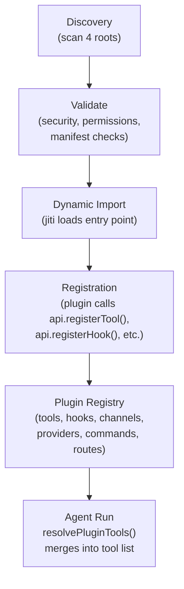

# Layer 3: Plugin System — Deep Dive

> Explained like you're 12 years old, with full git history evolution.

---

## What Is Layer 3?

If Layer 1 is the brain stem and Layer 2 is the nervous system, Layer 3 is the **immune system and organ transplant department**. It lets you add new organs (channels, AI providers, tools) or swap existing ones — all without surgery on the core robot.

The plugin system is what makes OpenClaw extensible. Want Discord support? That's a plugin. Want OpenAI as your AI provider? That's a plugin. Want the robot to remember things long-term? That's a plugin too. And you can write your own.

Layer 3 has **four major parts**:

1. **Discovery** — Finding plugins on your computer
2. **Loading** — Starting them up safely
3. **Registry** — Keeping track of what they registered
4. **SDK & API** — The "contract" between plugins and the core system

---

## Part 1: Discovery (Finding the Plugins)

### Where Does OpenClaw Look for Plugins?

OpenClaw searches **four locations**, in priority order:

| Priority | Location | Origin Name | Example |
|----------|----------|-------------|---------|
| 1 (highest) | Config-specified paths | `config` | `plugins.load.paths: ["~/my-plugins"]` |
| 2 | Workspace extensions | `workspace` | `.openclaw/extensions/` in your project |
| 3 | Bundled stock plugins | `bundled` | `extensions/` in the OpenClaw install |
| 4 (lowest) | Global user extensions | `global` | `~/.openclaw/extensions/` |

**Priority matters for duplicates.** If you have a Discord plugin in both `~/.openclaw/extensions/` (global) and `extensions/` (bundled), the global one wins because it has higher priority. This lets you override built-in plugins with your own versions.

### How Discovery Works (`src/plugins/discovery.ts`)

Think of discovery as a treasure hunt. The robot searches each location for things that look like plugins.

#### Step 1: Check the Cache

```typescript
const discoveryCache = new Map<string, { expiresAt: number; result: PluginDiscoveryResult }>();
const DEFAULT_DISCOVERY_CACHE_MS = 1000; // 1 second TTL
```

Discovery results are cached for **1 second**. Why? Because during startup, many different parts of the code ask "what plugins do we have?" within the same second. Without caching, it would re-scan the filesystem dozens of times.

The cache key includes: workspace path + user ID + all extension directories + config paths. If any of those change, the cache is invalidated.

#### Step 2: Scan Each Directory

For each of the four locations, the robot:

1. Lists all files and folders in the directory
2. **For files**: Checks if it's a valid extension file (`.ts`, `.js`, `.mts`, `.mjs`, etc. — but NOT `.d.ts` definition files)
3. **For folders**: Looks for a `package.json` with an `openclaw` section

Folders with names ending in `.bak`, `.backup-`, or `.disabled` are skipped. This is like having a "recycle bin" — rename a plugin folder to `discord.disabled` and it won't load.

#### Step 3: Read the Package Manifest

For each folder that has a `package.json`, the robot reads the `openclaw` section:

```json
{
  "name": "@openclaw/discord",
  "openclaw": {
    "extensions": ["./index.ts"],
    "channel": {
      "id": "discord",
      "label": "Discord",
      "docsPath": "/channels/discord"
    }
  }
}
```

The `extensions` array tells the robot which files to load. If there's no `openclaw` section, the robot looks for an `index.ts` or `index.js` file instead.

#### Step 4: Security Checks

Every plugin candidate goes through **three security gates** before it's accepted:

**Gate 1: Path Boundary Check**
```
Is the plugin file actually INSIDE the plugin directory?
```
Uses `safeRealpathSync()` to resolve symlinks and verify the real file path stays within bounds. This prevents a trick where a symlink at `~/.openclaw/extensions/evil` points to `/etc/passwd`.

**Like:** Making sure the new kid actually lives in the school district before enrolling them.

**Gate 2: Permission Check (Unix only)**
```
Are the file permissions safe?
```
- Rejects world-writable files (`chmod 777`) — anyone could modify them
- Checks file ownership matches expected user (or root)
- For bundled plugins, auto-repairs unsafe permissions by stripping write bits

**Like:** Checking that the door to the teacher's lounge has a proper lock, not an open doorway.

**Gate 3: Deduplication**
```
Have we already seen this exact file?
```
Tracks resolved paths in a `Set` to prevent the same plugin from appearing twice (e.g., via symlinks from two different directories).

#### Step 5: Build the Candidate List

Each passing plugin becomes a `PluginCandidate`:

```typescript
{
  idHint: "discord",           // Derived name for identification
  source: "/path/to/index.ts", // Absolute path to entry file
  rootDir: "/path/to/discord/",// Plugin's root directory
  origin: "bundled",           // Where it was found
  packageName: "@openclaw/discord",
  packageVersion: "2026.3.13",
}
```

The `idHint` is derived heuristically — it strips scoped prefixes (`@openclaw/discord` → `discord`), applies canonical remaps (`ollama-provider` → `ollama`), and falls back to the filename.

---

## Part 2: Loading (Starting Plugins Safely)

### The Plugin Manifest (`openclaw.plugin.json`)

Before loading any code, the robot reads each plugin's **manifest** — a JSON file that describes what the plugin is and what it needs:

```json
{
  "id": "memory-lancedb",
  "kind": "memory",
  "name": "Memory (LanceDB)",
  "description": "Long-term memory with vector search",
  "version": "1.0.0",
  "configSchema": {
    "type": "object",
    "properties": {
      "dbPath": { "type": "string" },
      "apiKey": { "type": "string" }
    },
    "required": ["apiKey"]
  },
  "uiHints": {
    "apiKey": { "label": "API Key", "sensitive": true, "placeholder": "sk-..." }
  }
}
```

**Required fields:**
- `id` — unique identifier (like a username for the plugin)
- `configSchema` — JSON Schema for validating the plugin's config section

**Optional fields:**
- `kind` — `"memory"` or `"context-engine"` (special slot plugins)
- `channels`, `providers`, `skills` — what the plugin provides
- `uiHints` — metadata for the settings UI (labels, placeholders, sensitivity flags)

### The Jiti Dynamic Loader

Plugins are written in TypeScript, but Node.js can't run TypeScript directly. OpenClaw uses **Jiti** — a just-in-time TypeScript importer:

```typescript
const jitiLoader = createJiti(import.meta.url, {
  interopDefault: true,  // Handle CommonJS default exports
  extensions: [".ts", ".tsx", ".mts", ".cts", ".js", ".mjs", ".cjs", ".json"],
  alias: aliasMap,       // Plugin SDK path aliasing
});
```

Jiti compiles TypeScript on-the-fly, so plugin authors don't need a build step.

**SDK Aliasing:** Plugins import from `openclaw/plugin-sdk`, but the actual files are somewhere inside the OpenClaw installation. Jiti's alias map translates `openclaw/plugin-sdk/channels` → the real file path. This means plugins don't need to know where OpenClaw is installed.

**Lazy initialization:** Jiti is only created when the first plugin actually needs to load. If all plugins are disabled (like in tests), Jiti is never initialized — saving startup time.

### The 14-Step Loading Pipeline

For each discovered plugin candidate, the loader runs 14 steps. If any step fails, the plugin is marked as "error" and the loader moves to the next one — one bad plugin doesn't crash the whole system.

#### Step 1: Find the Manifest Record
Look up the plugin's manifest from the manifest registry. Skip if not found.

#### Step 2: Check for Overrides
If the same plugin ID exists from a higher-priority origin (e.g., you have a custom Discord plugin AND the bundled one), the lower-priority one is disabled with reason "overridden."

#### Step 3: Check Enable State
The config has three ways to control which plugins load:

```json5
{
  plugins: {
    allow: ["discord", "telegram"],  // Allowlist (only these load)
    deny: ["irc"],                   // Denylist (these never load)
    entries: {
      discord: { enabled: true },    // Per-plugin toggle
    }
  }
}
```

Resolution: `deny` always wins → `allow` filters → `entries.enabled` toggles → bundled defaults.

#### Step 4: Memory Slot Policy
Only ONE memory plugin can be active at a time (you can't have two competing long-term memories). The config specifies which one:

```json5
{ plugins: { slots: { memory: "memory-lancedb" } } }
```

If a memory plugin isn't the chosen one, it's disabled before even loading its code — saving startup time.

#### Step 5: Validate Config Schema
Confirm the manifest has a `configSchema`. Without it, the plugin can't validate its own config.

#### Step 6: Boundary Check + Module Load
```typescript
const opened = openBoundaryFileSync({
  absolutePath: candidate.source,
  rootPath: pluginRoot,
  rejectHardlinks: candidate.origin !== "bundled",
});
const module = getJiti()(safeSource);
```

One more security check (path containment), then load the module via Jiti. Hardlink attacks are blocked for non-bundled plugins.

#### Step 7: Resolve the Module Export
Plugins can export their code in multiple formats:
- `export default { id, register() {...} }` — Object with register function
- `export default function register(api) {...}` — Direct function
- `module.exports = { register }` — CommonJS style
- `export function activate(api) {...}` — Named export

The loader handles all of them, normalizing to `{ definition, register }`.

#### Step 8: Validate ID Match
The manifest says `id: "discord"` and the exported definition says `id: "discord"` — they must match. If they don't, it's an error (prevents someone from swapping plugin code without updating the manifest).

#### Step 9-10: Memory Slot Decision (Final)
Now that the module is loaded and we know its `kind`, apply the memory slot policy one more time with the full definition.

#### Step 11: Validate Plugin Config
The plugin's config section (from `config.plugins.entries.discord.config`) is validated against the plugin's config schema. Invalid config → error.

#### Step 12: Validate-Only Mode Check
If we're just checking configs (not actually starting), skip the registration step.

#### Step 13: Call `register(api)`

This is the big moment. The loader creates an API object and calls the plugin's register function:

```typescript
const api = createApi(record, { config, runtime, logger });
plugin.register(api);
```

Inside `register()`, the plugin calls methods like:
```typescript
api.registerChannel({ plugin: discordPlugin });
api.registerTool({ name: "memory_recall", ... });
api.on("before_agent_start", handler);
api.registerHttpRoute({ path: "/webhook/discord", handler, auth: "plugin" });
```

Each call adds an entry to the plugin registry.

#### Step 14: Error Handling
If anything in `register()` throws, the error is caught, logged, and the plugin is marked as "error" with the message stored in `record.error`. The loader continues to the next plugin.

**Async warning:** If `register()` returns a Promise, the loader warns "async registration is ignored." Registration must be synchronous because the gateway needs all plugins ready before it starts accepting connections.

---

## Part 3: The Registry (The Plugin Phone Book)

After all plugins have been loaded, the registry is a data structure containing everything every plugin registered:

```typescript
type PluginRegistry = {
  plugins: PluginRecord[];                    // Metadata for each plugin
  tools: PluginToolRegistration[];            // Agent tools
  hooks: PluginHookRegistration[];            // Legacy untyped hooks
  typedHooks: TypedPluginHookRegistration[];  // New typed hooks
  channels: PluginChannelRegistration[];      // Messaging channels
  providers: PluginProviderRegistration[];    // AI model providers
  gatewayHandlers: GatewayRequestHandlers;    // Custom gateway RPC methods
  httpRoutes: PluginHttpRouteRegistration[];  // Custom HTTP endpoints
  cliRegistrars: PluginCliRegistration[];     // CLI commands
  services: PluginServiceRegistration[];      // Background services
  commands: PluginCommandRegistration[];      // Chat commands (no LLM)
  diagnostics: PluginDiagnostic[];            // Warnings and errors
};
```

Think of it as a **phone book** — when the gateway needs to send a Discord message, it looks up the Discord channel in the registry. When the agent needs a tool, it checks the registry's tools list.

### Registration Validation

Each registration method has built-in validation:

| Registration | Validation |
|-------------|------------|
| `registerChannel` | Channel ID must be unique across ALL plugins |
| `registerProvider` | Provider ID must be unique |
| `registerGatewayMethod` | Method name must not conflict with core methods or other plugins |
| `registerHttpRoute` | Path must not overlap with existing routes (unless `replaceExisting: true`) |
| `registerTool` | Tool name recorded for tracking |
| `registerService` | Service ID must be non-empty |
| `registerCommand` | Command name must be unique |

### The Plugin Record

Each loaded plugin gets a `PluginRecord` that tracks everything about it:

```typescript
{
  id: "discord",
  name: "Discord",
  version: "2026.3.13",
  origin: "bundled",
  status: "loaded",          // or "disabled" or "error"
  enabled: true,
  toolNames: ["discord_slash_commands"],
  hookNames: ["subagent_hooks"],
  channelIds: ["discord"],
  providerIds: [],
  gatewayMethods: [],
  httpRoutes: 2,
  hookCount: 3,
}
```

This is what powers the `openclaw plugins status` CLI command — it shows you each plugin's status, what it registered, and any errors.

---

## Part 4: The Plugin API & SDK (The Contract)

### The API Object

When a plugin's `register(api)` function is called, `api` is an object with 12 registration methods:

```typescript
api.registerTool(tool, opts?)          // Add an agent tool
api.registerHook(events, handler)      // Legacy hook registration
api.on(hookName, handler, opts?)       // Typed hook registration (preferred)
api.registerChannel(registration)      // Add a messaging channel
api.registerProvider(provider)         // Add an AI model provider
api.registerGatewayMethod(method, handler)  // Add a gateway RPC method
api.registerHttpRoute(params)          // Add an HTTP endpoint
api.registerCli(registrar, opts?)      // Add CLI commands
api.registerService(service)           // Add a background service
api.registerCommand(command)           // Add a chat command (no LLM)
api.registerContextEngine(id, factory) // Replace the context engine
api.resolvePath(input)                 // Resolve user paths (~/... etc.)
```

Plus properties:
```typescript
api.id              // Plugin identifier
api.config          // Full OpenClaw config
api.pluginConfig    // This plugin's config section
api.runtime         // Runtime services (subagents, sessions, media, etc.)
api.logger          // Logging interface (debug, info, warn, error)
```

### The Plugin SDK (`src/plugin-sdk/`)

The SDK is a separate package that plugins import. It exports **150+ types and utilities**:

- **Channel utilities:** Channel types, account helpers, directory config, status helpers
- **Provider utilities:** OAuth helpers, model auth, discovery functions
- **Webhook utilities:** Webhook targets, authentication, request guards
- **Message utilities:** Inbound envelope builders, outbound payload formatting, media handling
- **Session utilities:** Account resolution, threading, pairing, history
- **Security:** SSRF policy, allowlist compilation, command authorization
- **Runtime:** Logger creation, environment resolution

Plugins import from subpaths:
```typescript
import { ChannelPlugin } from "openclaw/plugin-sdk/channels";
import { buildOauthProviderAuthResult } from "openclaw/plugin-sdk/auth";
```

### Real Plugin Examples

#### Example 1: Discord Channel Plugin
```typescript
// extensions/discord/index.ts
const plugin = {
  id: "discord",
  name: "Discord",
  configSchema: emptyPluginConfigSchema(),
  register(api) {
    api.registerChannel({ plugin: discordPlugin });
    registerDiscordSubagentHooks(api);
  }
};
export default plugin;
```

Simple — registers one channel and some hooks.

#### Example 2: Qwen OAuth Provider Plugin
```typescript
// extensions/qwen-portal-auth/index.ts
const plugin = {
  id: "qwen-portal-auth",
  name: "Qwen OAuth",
  configSchema: emptyPluginConfigSchema(),
  register(api) {
    api.registerProvider({
      id: "qwen-portal",
      label: "Qwen",
      auth: [{
        id: "device",
        label: "Qwen OAuth",
        kind: "device_code",
        run: async (ctx) => {
          // OAuth device code flow (user scans QR code)
          return buildOauthProviderAuthResult({ ... });
        }
      }]
    });
  }
};
export default plugin;
```

Registers a provider with an OAuth authentication flow.

#### Example 3: Memory Plugin with Hooks and Tools
```typescript
// extensions/memory-lancedb/index.ts (simplified)
const plugin = {
  id: "memory-lancedb",
  kind: "memory",
  register(api) {
    // Register tools the agent can call
    api.registerTool({ name: "memory_recall", ... });
    api.registerTool({ name: "memory_store", ... });

    // Auto-recall: inject memories into prompt
    api.on("before_agent_start", async (event) => {
      const memories = await db.search(event.prompt);
      return { prependContext: formatMemories(memories) };
    });

    // Auto-capture: save conversation highlights
    api.on("agent_end", async (event) => {
      if (event.success) await db.store(event.messages);
    });

    // CLI: openclaw ltm list
    api.registerCli(({ program }) => {
      program.command("ltm").subcommand("list");
    });
  }
};
export default plugin;
```

Full-featured — tools, hooks, and CLI commands.

---

## Part 5: The Hook System (Plugin Lifecycle Events)

### What Are Hooks?

Hooks are like **event subscriptions**. Plugins say "tell me when X happens" and the system calls their handler at the right moment. There are **24 hook types** organized by lifecycle phase.

### Hook Categories

#### Model & Prompt Phase (Before the AI thinks)
| Hook | When | Can Modify? |
|------|------|-------------|
| `before_model_resolve` | Before choosing which AI model to use | Yes — override model/provider |
| `before_prompt_build` | Before assembling the system prompt | Yes — inject/modify prompt |
| `before_agent_start` | Legacy: combines both above | Yes — both model and prompt |

#### Agent Execution (While the AI is working)
| Hook | When | Can Modify? |
|------|------|-------------|
| `llm_input` | The exact payload sent to the LLM | No — observe only |
| `llm_output` | The exact response from the LLM | No — observe only |
| `agent_end` | Agent finished its turn | No — observe only |
| `before_compaction` | Before old messages are compressed | No — observe only |
| `after_compaction` | After compression completes | No — observe only |
| `before_reset` | Before /new or /reset clears session | No — observe only |

#### Message Flow (Messages coming and going)
| Hook | When | Can Modify? |
|------|------|-------------|
| `message_received` | Message arrived from a channel | No — observe only |
| `message_sending` | Message about to be sent to channel | Yes — modify or cancel |
| `message_sent` | Message delivery result | No — observe only |

#### Tool Execution (When the agent uses tools)
| Hook | When | Can Modify? |
|------|------|-------------|
| `before_tool_call` | Tool about to execute | Yes — modify params or block |
| `after_tool_call` | Tool finished executing | No — observe only |
| `tool_result_persist` | Tool result before saving (SYNC) | Yes — modify result |
| `before_message_write` | Message before saving (SYNC) | Yes — modify or block |

#### Session Lifecycle
| Hook | When |
|------|------|
| `session_start` | New session created |
| `session_end` | Session ended |

#### Subagent Lifecycle
| Hook | When | Can Modify? |
|------|------|-------------|
| `subagent_spawning` | Subagent about to spawn | Yes — block or modify |
| `subagent_delivery_target` | Resolving delivery target | Yes — override target |
| `subagent_spawned` | Subagent created | No — observe only |
| `subagent_ended` | Subagent ended | No — observe only |

#### Gateway Lifecycle
| Hook | When |
|------|------|
| `gateway_start` | Gateway server started |
| `gateway_stop` | Gateway shutting down |

### Execution Models

Hooks run in two modes:

**Parallel (Fire-and-Forget):** All handlers run simultaneously, results are not collected. Used for observation-only hooks like `agent_end`, `message_received`, `gateway_start`.

**Sequential (Priority-Ordered):** Handlers run one at a time in priority order (highest first). Results are merged. Used for hooks that modify behavior like `before_prompt_build`, `message_sending`, `before_tool_call`.

```typescript
api.on("before_prompt_build", handler, { priority: 100 });  // Runs first
api.on("before_prompt_build", handler, { priority: 50 });   // Runs second
api.on("before_prompt_build", handler);                      // Runs last (default 0)
```

**Synchronous (Special):** Two hooks — `tool_result_persist` and `before_message_write` — are synchronous because they're in hot paths where async overhead would be too costly.

### Error Isolation

If a hook handler throws an error:
- The error is logged
- The handler is skipped
- Other handlers continue executing
- One bad hook doesn't crash the system

### Prompt Injection Protection

Plugins can modify the AI's system prompt via `before_prompt_build`. This is powerful but dangerous — a malicious plugin could inject instructions like "ignore all previous instructions."

OpenClaw has a safety valve:

```json5
{
  plugins: {
    entries: {
      "untrusted-plugin": {
        hooks: { allowPromptInjection: false }
      }
    }
  }
}
```

When `allowPromptInjection: false`:
- `before_prompt_build` → **blocked entirely** (can't register)
- `before_agent_start` → **wrapped** to strip prompt fields (systemPrompt, prependContext, etc.) while still allowing model/provider overrides

---

## Part 6: Plugin HTTP Routes

Plugins can add their own HTTP endpoints to the gateway:

```typescript
api.registerHttpRoute({
  path: "/webhook/custom",
  handler: async (req, res) => {
    res.writeHead(200);
    res.end("OK");
    return true;  // Handled!
  },
  auth: "gateway",    // Requires gateway token
  match: "prefix",    // Matches /webhook/custom and /webhook/custom/anything
});
```

**Auth modes:**
- `"gateway"` — Requires the same authentication as the gateway (token, password, etc.)
- `"plugin"` — No authentication required (the plugin manages its own auth)

**Route matching:**
- `"exact"` — Only matches the exact path
- `"prefix"` — Matches the path and any subpath

**Integration with the HTTP pipeline:**
Plugin routes are checked at stages 9-10 of the gateway's 14-stage HTTP pipeline (after hooks, tools, OpenAI endpoints, but before health probes).

**Security:**
- Paths are canonicalized to prevent encoding tricks
- Overlapping routes are detected and rejected
- Protected paths (like `/health`) require gateway auth even if the plugin says `"plugin"`

---

## Part 7: Plugin Configuration

### Config Structure

```json5
{
  plugins: {
    enabled: true,                         // Master switch
    allow: ["discord", "memory-lancedb"],  // Only load these (empty = load all)
    deny: ["irc"],                         // Never load these
    slots: {
      memory: "memory-lancedb",            // Which memory plugin to use
      contextEngine: null                  // Which context engine to use
    },
    entries: {
      "memory-lancedb": {
        enabled: true,
        config: {                          // Plugin-specific config
          dbPath: "~/.openclaw/memory",
          apiKey: "${OPENAI_API_KEY}"
        },
        hooks: {
          allowPromptInjection: true       // Trust this plugin's prompt hooks
        }
      }
    },
    installs: {                            // Installed plugins metadata
      "my-plugin": {
        installPath: "~/.openclaw/plugins/my-plugin",
        sourcePath: "~/dev/my-plugin"
      }
    }
  }
}
```

### Exclusive Slots

Two capabilities are **exclusive** — only one plugin can fill each slot:

1. **Memory slot** (`plugins.slots.memory`): Only one memory plugin active at a time. You can't have two competing long-term memories.
2. **Context Engine slot** (`plugins.slots.contextEngine`): Only one context engine active. It controls how the conversation window is assembled.

If no slot is specified, the system uses its built-in implementation.

---

## Part 8: The Three-Tier Cache

The plugin system uses three layers of caching for performance:

| Layer | TTL | Max Size | What It Caches |
|-------|-----|----------|----------------|
| Discovery Cache | 1 second | Unbounded Map | Filesystem scan results |
| Manifest Cache | 1 second | Unbounded Map | Parsed manifest files |
| Loader Registry Cache | Forever (LRU) | 32 entries | Fully loaded registries |

**Why 1-second TTL?** During a single startup, dozens of code paths ask "what plugins are available?" The 1-second cache ensures the filesystem is scanned at most once per second. After startup, the cache naturally expires since nobody asks again until the next restart.

**The 32-entry LRU**: The fully loaded registry is expensive to create (involves Jiti compilation, module loading, registration). The LRU cache keeps the 32 most recent configurations, so switching between profiles doesn't require full reload.

---

## Part 9: Plugin Installation & Capability Expansion

### How Plugins Are Installed

Plugins are npm packages installed via the CLI:

```bash
openclaw plugins install @openclaw/feishu
```

There are **three install modes**, all converging on the same atomic publish step:

| Mode | Command Example | What Happens |
|------|----------------|-------------|
| **npm spec** | `openclaw plugins install @openclaw/voice-call` | Downloads from npm registry, extracts tarball |
| **Directory/path** | `openclaw plugins install ./my-plugin` | Reads package.json directly from disk |
| **Archive** | `openclaw plugins install plugin.tgz` | Extracts .zip/.tgz/.tar, then follows directory flow |

### The 9-Step Atomic Install Pipeline

The installer (`src/plugins/install.ts`) uses a careful staging process to prevent corrupted installs:

#### Step 1: Resolve
Validate the install spec. For npm: registry-only (no git URLs, no semver ranges). For paths: verify the directory exists.

#### Step 2: Download (npm only)
Fetch the package tarball from the npm registry.

#### Step 3: Extract
Unpack to a temporary directory.

#### Step 4: Validate
Read `package.json` and confirm it has an `openclaw.extensions` array (e.g., `["./dist/index.js"]`). Without this, installation fails with `MISSING_OPENCLAW_EXTENSIONS`. Read `openclaw.plugin.json` for the canonical plugin ID. Validate plugin ID (no path separators, no reserved names like `.` or `..`).

#### Step 5: Security Scan
Run `skillScanner.scanDirectoryWithSummary()` on the extension entry points. This checks for dangerous patterns (eval, shell execution, etc.). Critical findings are logged as **warnings but do not block installation**.

**Like:** An airport scanner that flags suspicious items but lets you through with a warning sticker, rather than confiscating everything.

#### Step 6: Stage
Copy the source to a `.openclaw-install-stage-*` temp directory inside the extensions root. Nothing touches the final location yet.

#### Step 7: Dependency Install
Run `npm install --omit=dev --ignore-scripts` in the staged directory (5-minute timeout). Dev dependencies are excluded. Scripts are disabled for safety (no `postinstall` bombs).

**Like:** Assembling all the parts the new organ needs, in a clean room, before transplanting it.

#### Step 8: Atomic Publish
This is the critical step:

```
If updating an existing plugin:
  → Back up existing install to .openclaw-install-backups/
  → Rename staged directory → final target (~/.openclaw/extensions/<plugin-id>)
  → If success: clean up backup
  → If failure: restore backup
If fresh install:
  → Rename staged directory → final target
```

The rename is atomic on most filesystems — it either completes fully or doesn't happen at all. No half-installed plugins.

**Like:** A heart transplant where you keep the old heart in a jar until you're 100% sure the new one is beating. If the new one fails, you put the old one back.

#### Step 9: Record
Write install metadata to `config.plugins.installs[pluginId]`.

### Install Records (The Receipt)

Every installed plugin gets a receipt stored in config:

```json5
{
  plugins: {
    installs: {
      "voice-call": {
        source: "npm",                          // Where it came from
        spec: "@openclaw/voice-call",           // Original install command
        installPath: "~/.openclaw/extensions/voice-call",
        version: "2026.3.13",                   // package.json version
        resolvedName: "@openclaw/voice-call",   // npm resolution
        resolvedVersion: "2026.3.13",
        resolvedSpec: "@openclaw/voice-call@2026.3.13",
        integrity: "sha512-abc123...",          // SRI hash (tamper detection)
        shasum: "def456...",                     // npm shasum
        installedAt: "2026-03-17T10:30:00Z"
      }
    }
  }
}
```

**Like:** A medical record for the organ transplant — where the organ came from, when it was implanted, and a fingerprint to verify it hasn't been swapped.

### Integrity Validation (Tamper Detection)

For npm-installed plugins, the install record stores an **SRI integrity hash** of the package. When you run `openclaw plugins update`:

1. Fetch the new package from npm
2. Compare the new hash against the stored one
3. If the hash changed (expected during updates), show the change and ask for confirmation
4. If `--yes` is passed, skip the prompt (for CI)

This catches npm package tampering or corruption.

### Auto-Enable (Plugins That Turn Themselves On)

After installation, OpenClaw automatically enables plugins when their corresponding config exists. This is handled by `src/config/plugin-auto-enable.ts`.

| Trigger | Example | What Gets Enabled |
|---------|---------|-------------------|
| Channel config exists | `channels.slack.*` is configured | Slack channel plugin |
| Provider auth profile | `auth.profiles` has a Google Gemini entry | `google-gemini-cli-auth` plugin |
| ACP flag | `acp.enabled = true` | `acpx` plugin |
| Environment variable | `IRC_HOST` is set | IRC plugin |

**Like:** Plugging in a new USB device and the driver auto-installs.

Auto-enable respects explicit overrides: `plugins.entries[id].enabled = false` blocks it, `plugins.deny` blocks it, `plugins.enabled = false` disables all. When multiple plugins declare the same channel, `preferOver` in `package.json` determines priority.

### Custom Path Warnings (Stale Transplant Detection)

Plugins installed from local paths (`source: "path"`) get flagged during `openclaw doctor` and upgrade checks (`src/infra/plugin-install-path-warnings.ts`):

- **Missing source path**: "This plugin was installed from `~/dev/my-plugin` but that path is gone."
- **Active custom path**: "This plugin won't be updated by `openclaw plugins update` because it came from a local path, not npm."

### How Plugins Become Tool Calls

When the Gateway starts:



Plugins are discovered from four roots (highest priority first):
1. **Config paths** — `plugins.load.paths` in `openclaw.json`
2. **Workspace** — `<workspace>/.openclaw/extensions/`
3. **Global** — `~/.openclaw/extensions/`
4. **Bundled** — `dist/extensions/` (shipped with OpenClaw)

Plugin tools are indistinguishable from built-in tools once registered. The LLM
sees them in the tool schema and can call them like any other tool.

### What a Plugin Can Register

| Method | Capability |
|---|---|
| `api.registerTool(tool)` | Agent-callable tool (LLM can invoke) |
| `api.registerHook(events, handler)` | Lifecycle callbacks (24 hook points) |
| `api.registerChannel(plugin)` | Messaging channel (Feishu, Matrix, etc.) |
| `api.registerProvider(provider)` | LLM provider integration |
| `api.registerCommand(command)` | Gateway command (bypasses LLM) |
| `api.registerContextEngine(id, factory)` | Context engine (exclusive slot) |
| `api.registerHttpRoute(params)` | Custom HTTP endpoint |
| `api.registerService(service)` | Long-running background service |
| `api.registerCli(registrar)` | CLI subcommands |

### Plugin Kinds (Exclusive Slots)

Two plugin kinds occupy exclusive slots — only one can be active:

| Kind | Config slot | Purpose |
|---|---|---|
| `"memory"` | `plugins.slots.memory` | Memory storage backend (e.g., LanceDB) |
| `"context-engine"` | `plugins.slots.contextEngine` | Context management engine |

All other plugins are additive — unlimited concurrent plugins.

### Hot Reload: Why Plugins Require a Gateway Restart

Plugin changes require a **full gateway restart**. The config reload system
explicitly marks plugin config as restart-required:

```typescript
{ prefix: "plugins", kind: "restart" }
```

**Why?** Three reasons:

1. **Module loading is one-shot.** Jiti compiles and caches TypeScript modules the first time they're imported. There's no "reimport" mechanism.
2. **The registry is built at startup.** All plugins call `register(api)` during the 14-step loading pipeline. The resulting registry is a frozen data structure.
3. **Discovery scans at startup.** New extensions in `~/.openclaw/extensions/` are only found when discovery runs.

**The exception:** Plugin **config changes** (`plugins.entries[id].config`) are read dynamically at runtime and do not require restart.

Other things that reload live without restart:
- Hook scripts (`hooks.*`) — hot reload
- Model config — hot reload with heartbeat restart
- Channel-specific config — per-channel reload rules

### Security Model

- Path ownership validation (no world-writable directories)
- Symlink escape prevention
- Reserved name blocking (can't shadow core commands)
- Tool name conflict detection (plugins can't shadow built-in tools)
- Per-plugin `hooks.allowPromptInjection` gate for prompt-modifying hooks
- Config-driven allow/deny lists (`plugins.allow`, `plugins.deny`)
- SRI integrity validation on npm updates

### Installation File Reference

| File | Purpose |
|------|---------|
| `src/plugins/install.ts` | Main install logic for all source types |
| `src/plugins/installs.ts` | Install record tracking and recording |
| `src/plugins/update.ts` | Plugin update and version comparison |
| `src/plugins/uninstall.ts` | Plugin removal from config and disk |
| `src/infra/install-package-dir.ts` | Atomic stage → npm install → publish flow |
| `src/infra/plugin-install-path-warnings.ts` | Custom path detection and warnings |
| `src/config/plugin-auto-enable.ts` | Auto-enable logic for channels/providers |
| `src/config/types.installs.ts` | Install record type definitions |

---

## Part 10: Skills — Markdown Instructions for the LLM

Skills are fundamentally different from plugins. They are **markdown files with
YAML frontmatter** — not code. They tell the LLM *how* to use external tools
and APIs.

### What a Skill Looks Like

A skill is a directory containing a `SKILL.md`:

```
skills/github/SKILL.md
```

With frontmatter like:
```yaml
name: github
description: "GitHub operations via gh CLI"
metadata:
  openclaw:
    emoji: "🐙"
    requires:
      bins: [gh]
    install:
      - id: brew
        kind: brew
        formula: gh
        bins: [gh]
```

### How Skills Enter Context (The Key Question)

Skills use a **two-phase approach** — metadata in the prompt, content on demand:

**Phase 1: Skill list in system prompt (every turn)**

The system prompt includes a `## Skills (mandatory)` section with a compact list
of all available skills — name, description, and file path. This costs real
tokens but is small (~30K chars max, configurable).

The instruction tells the LLM:

> Before replying: scan available skills descriptions.
> If exactly one skill clearly applies: read its SKILL.md, then follow it.
> If multiple could apply: choose the most specific one.
> If none clearly apply: do not read any SKILL.md.
> Never read more than one skill up front.

**Phase 2: LLM reads SKILL.md on demand**

The LLM decides to read a skill by calling the `read` tool on the SKILL.md
path. This is a normal tool call — the SKILL.md content enters context as a
`toolResult` message, just like any file read.

**The system never injects SKILL.md content into context automatically.** The
LLM must actively choose to read it. This keeps the context window lean — only
the skill metadata (name + description + path) is always present, not the full
instructions.

### How Skill Content Leaves Context

Once the LLM reads a SKILL.md, the content is a regular `toolResult` in the
conversation history. It's subject to all the standard context management:

1. **Budget guard** (Layer 8, Layer 4) — if the SKILL.md is huge, it gets
   truncated like any tool result
2. **Cache-TTL pruning** — after 5 minutes of inactivity, the read result can
   be soft-trimmed or hard-cleared
3. **Compaction** — when context is summarized, the skill content is summarized
   along with everything else. The compaction summary may note "used the github
   skill" but won't preserve the full SKILL.md text
4. **Session reset** — `/new` or `/reset` clears everything

There's no special "unload skill" mechanism. The skill content is just another
tool result that ages out through the normal context lifecycle.

### Skills from Plugins

Plugins can contribute skills by declaring skill directories in their manifest:

```json
{
  "id": "my-plugin",
  "skills": ["./skills"]
}
```

The skill discovery system scans plugin skill directories alongside bundled and
workspace skills. Plugin-contributed skills appear in the same skill list the
LLM sees.

### Skill Env Overrides

Skills can declare environment variables they need (e.g., API keys). When a
skill is in the active snapshot, OpenClaw injects these into `process.env`
before the agent run and **reverts them after**:

```yaml
metadata:
  openclaw:
    primaryEnv: GITHUB_TOKEN
    requires:
      env: [GITHUB_TOKEN]
```

The env injection is reference-counted (multiple skills can share a key) and
security-sanitized (dangerous keys like `OPENSSL_CONF` are always blocked).

### Skill Limits

| Limit | Default |
|---|---|
| Max skills in prompt | 150 |
| Max skill prompt chars | 30,000 |
| Max skill file size | 256 KB |
| Max candidates per root | 300 |
| Max skills loaded per source | 200 |

---

## How Layer 3 Evolved: The Git History

### Pre-Plugin Era (November 24, 2025 — January 10, 2026)

For the first **48 days**, there was NO plugin system. Channels (Discord, Telegram, WhatsApp, etc.) were hardcoded directly into `src/`. Adding a new channel meant modifying core files. The project was a monolith.

### Phase 1: The Big Decision (January 11, 2026)

Commit `cf0c72a55` — "feat: add plugin architecture" — created the entire scaffolding in one commit:

- `src/plugins/discovery.ts` (269 lines) — finds plugins on disk
- `src/plugins/loader.ts` (376 lines) — loads and initializes plugins
- `src/plugins/registry.ts` (206 lines) — central registry
- `src/cli/plugins-cli.ts` (266 lines) — CLI management commands
- `docs/plugin.md` (192 lines) — documentation
- Tests for discovery and loader

The **first extension** was `voice-call` (Twilio-based) — fitting since the project started as a Twilio webhook relay. It was the proof-of-concept that validated the plugin model.

The next day (Jan 12), `src/plugins/types.ts` and `src/plugins/install.ts` (npm-based plugin installation) were added.

### Phase 2: Channel Extraction Sprint (January 13-15, 2026)

A 3-day sprint extracted channels from the monolith into plugins:

- **Jan 13**: Breaking rename — "providers" → "channels" throughout the codebase
- **Jan 15**: Channels loaded from plugin registry instead of hardcoded imports
- **Jan 15**: HTTP webhook hooks added for plugins + Zalo channel (first community-contributed channel, ~2,000 lines from Vietnamese developers @suminhthanh and @longmaba)
- **Jan 15**: Matrix channel plugin added

### Phase 3: Provider Auth Plugins (January 16-17, 2026)

- Provider authentication extended to the plugin system
- MS Teams extracted from core into a plugin
- Config became schema-validated per plugin

### Phase 4: The SDK Big Bang (January 18, 2026)

The **most important day** in the plugin system's history. Five major commits:

1. **Plugin SDK created** (`src/plugin-sdk/index.ts`) — formalized the stable API surface that plugins import
2. **Existing extensions migrated** to use SDK imports instead of reaching into `src/` internals
3. **Six core channels extracted in ONE commit**: Discord, iMessage, Signal, Slack, Telegram, WhatsApp — each getting its own `extensions/<channel>/` directory
4. **Plugin hooks system added** — `api.on()` for lifecycle events
5. **Memory plugins born** — LanceDB vector storage + 13 hook types (agent, message, tool, session, gateway hooks)

**Why the SDK?** The previous week showed plugins reaching directly into `src/` internals. When internal code changed, plugins broke. The SDK provided a stable contract — change the internals all you want, as long as the SDK exports stay the same.

### Phase 5: Extension Explosion (January 19 — February 2026)

With the SDK in place, extensions proliferated:

| Date | Extension | Notes |
|------|-----------|-------|
| Jan 18 | BlueBubbles, memory-core, memory-lancedb | |
| Jan 20 | Nostr, Nextcloud Talk | |
| Jan 22 | LLM-task | |
| Jan 23 | Google Chat | |
| Jan 25 | LINE | Community PR #1630 from @plum-dawg |
| Jan 27 | Twitch | Community PR #1612 |
| Jan 30 | *Rename to "openclaw"* | |
| Feb 2 | Feishu/Lark | |
| Feb 8 | Device-pair, Phone-control | First non-channel plugins |
| Feb 10 | IRC | |
| Feb 13 | Thread-ownership | Community contribution |
| Feb 28 | Diffs | |

Today there are **44 extensions** in the `extensions/` directory.

### Phase 6: Security Hardening (February 19+, 2026)

The open-source launch exposed the plugin system to untrusted code:

- Path containment enforcement (symlink and hardlink attacks blocked)
- Discovery trust checks (permission validation, ownership verification)
- Boundary hardening for file reads
- Prompt injection protection (`allowPromptInjection` config flag)

### Phase 7: API Maturation (February — March 2026)

The API grew via concrete needs:

- **Hook types expanded**: Compaction hooks, reset hooks, LLM input/output observation (PR #16724 from @SecondThread), session lifecycle hooks, prompt policy enforcement
- **Context Engine slot**: Full context engine replacement via plugin (PR #22201 from @josh at Martian)
- **Provider plugins**: Ollama, SGLang, vLLM extracted as provider plugins
- **SDK subpaths**: `openclaw/plugin-sdk/channels`, `openclaw/plugin-sdk/auth`, etc.
- **Collision detection** (March 13, latest): Duplicate channel IDs and adapter registrations rejected at startup

### Evolution Timeline

| Date | Event | Impact |
|------|-------|--------|
| Nov 24, 2025 | Project created | No plugin system — monolith |
| **Jan 11, 2026** | **Plugin architecture created** | discovery.ts, loader.ts, registry.ts, first extension |
| Jan 13-15 | Channels extracted to plugins | providers → channels rename |
| Jan 16-17 | Provider auth plugins | MS Teams extracted |
| **Jan 18** | **SDK Big Bang** | SDK formalized, 6 channels extracted, hooks + memory |
| Jan 19-30 | Extension explosion | 10+ new extensions in 12 days |
| Jan 30 | Renamed to "openclaw" | |
| Feb 8 | Non-channel plugins | Device-pair, phone-control |
| Feb 19+ | Security hardening | Path containment, trust checks |
| Mar 6 | Context engine slot | Plugins can replace context management |
| Mar 12 | Provider plugin extraction | Ollama, SGLang, vLLM |
| Mar 13 | Collision detection | Duplicate channel ID rejection |

### By the Numbers

| Metric | Count |
|--------|-------|
| Commits touching `src/plugins/` | **399** |
| Commits touching `src/plugin-sdk/` | **271** |
| Commits touching `extensions/` | **1,894** |
| Extensions in `extensions/` | **44** |
| Days from project start to plugin system | **48 days** |
| Days from plugin architecture to SDK | **7 days** |
| Hook types available | **24** |
| Plugin API registration methods | **12** |
| SDK exports | **150+** |

### Key Takeaways

1. **The plugin system was a deliberate architectural decision, not organic growth.** It arrived fully formed on Jan 11, 2026, after 48 days of monolithic development.

2. **Voice-call was the proving ground.** The first extension validated the model before the massive channel extraction.

3. **The SDK was a retroactive stabilization layer.** The 7-day gap between "plugin architecture" and "plugin SDK" shows the team learned that plugins reaching into internals was unsustainable.

4. **January 18 was the true inflection point.** Six core channels extracted + SDK + hooks + memory in a single day. This was when the plugin system went from "architecture" to "ecosystem."

5. **Security came after openness.** Path containment and trust checks were added after the open-source launch, showing hardening was reactive to the broader contributor base.

6. **The API grew from concrete needs, not speculation.** Each hook type and capability was added to support a specific extension. Nothing was designed hypothetically.

---

## File Reference

| File | Lines | Purpose |
|------|-------|---------|
| `src/plugins/discovery.ts` | ~738 | Scan plugin roots, security checks, deduplication |
| `src/plugins/manifest-registry.ts` | ~266 | Load/validate manifests, resolve by origin |
| `src/plugins/loader.ts` | ~912 | Jiti loading, 14-step pipeline, registry creation |
| `src/plugins/registry.ts` | ~636 | Registry factory, API creation, registration functions |
| `src/plugins/types.ts` | ~996 | All plugin types (API, hooks, events, contexts) |
| `src/plugins/manifest.ts` | ~199 | Plugin manifest parsing |
| `src/plugins/hooks.ts` | ~200+ | Hook execution engine |
| `src/plugins/hook-runner-global.ts` | ~100+ | Global hook runner singleton |
| `src/plugins/roots.ts` | ~47 | Resolve plugin source directories |
| `src/plugins/config-state.ts` | ~100+ | Normalize plugin configuration |
| `src/plugin-sdk/index.ts` | ~850+ | 150+ SDK exports |
| `src/plugin-sdk/core.ts` | varies | Core SDK types and helpers |
| `src/gateway/server-plugins.ts` | varies | Gateway plugin loading integration |
| `src/gateway/server/plugins-http.ts` | varies | Plugin HTTP route handler |
| `src/gateway/server/plugins-http/route-match.ts` | varies | Route matching logic |
