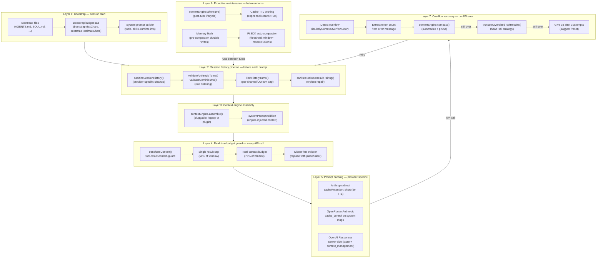

# Layer 8: Context Engine — Deep Dive

> Explained like you're 12 years old, with full git history evolution.

---

## What Is the Context Engine? (The Simple Version)

Imagine you're having a really long conversation with a friend — like, you've been texting all day for weeks. Your phone has unlimited storage, so every text is saved. But here's the problem: your friend has a **limited memory**. They can only "remember" the last few pages of the conversation at any given time.

That's exactly what happens with AI models. OpenClaw stores **every message** you've ever sent, but the AI model can only look at a certain number of words at once (its "context window" — usually 128K or 200K tokens). The **Context Engine** is the system that decides:

1. **Which messages** the AI gets to see right now
2. **When to summarize** old messages to make room for new ones
3. **How to recover** when there are just too many messages to fit
4. **How to manage** conversations that spawn sub-conversations

Think of it like a librarian managing a small reading desk. The library has thousands of books (all your messages), but the desk only fits 20 books at a time. The librarian decides which 20 books to put on the desk, and when the desk gets full, they write a summary of the old books on a sticky note and replace them with the note.

---

## Part 1: The ContextEngine Interface — The Contract

**File:** `src/context-engine/types.ts` (177 lines)

The Context Engine starts with a **contract** — a TypeScript interface that says "any context engine must be able to do these things." This is like a job description: "To be a librarian, you must be able to shelve books, find books, and write summaries."

### The Lifecycle Methods

Every context engine follows this lifecycle during a conversation turn:

```
bootstrap → ingest → assemble → [AI runs] → afterTurn → compact → dispose
```

Here's what each one does:

#### 1. `bootstrap(sessionId, sessionKey?, sessionFile)`
**When:** At the start of a session
**What:** Initialize the engine's internal state. Like a librarian opening the library in the morning — check what books are already on shelves, set up the card catalog.
**Returns:** `BootstrapResult` with:
- `bootstrapped: boolean` — did it actually initialize?
- `importedMessages?: number` — did it import old history?
- `reason?: string` — why it skipped, if it did

#### 2. `ingest(sessionId, message, isHeartbeat?)` and `ingestBatch(messages)`
**When:** After each message is created
**What:** Feed new messages into the engine so it can track them. Like handing a new book to the librarian so they know it exists.
**Returns:** `IngestResult` with `ingested: boolean` — the engine might reject duplicates

#### 3. `assemble(sessionId, messages, tokenBudget?)`
**When:** Right before sending messages to the AI model
**What:** This is the big one. Given ALL messages and a token budget, pick and arrange the messages the AI should see. The librarian picks which 20 books go on the reading desk.
**Returns:** `AssembleResult` with:
- `messages: AgentMessage[]` — the ordered messages to send to the AI
- `estimatedTokens: number` — how many tokens this uses
- `systemPromptAddition?: string` — extra instructions to prepend to the system prompt (e.g., "Here's a summary of what happened earlier...")

#### 4. `compact(sessionId, sessionFile, tokenBudget?, force?)`
**When:** After a turn, or when overflow is detected
**What:** Summarize old messages to free up space. The librarian writes summary sticky notes and removes old books from the desk.
**Returns:** `CompactResult` with:
- `ok: boolean` — did it succeed?
- `compacted: boolean` — did it actually change anything?
- `reason?: string` — status message
- `result?` — details including `summary`, `tokensBefore`, `tokensAfter`, `firstKeptEntryId`

The compact method has extra parameters for fine control:
- `currentTokenCount` — the caller's observed token count (not just an estimate)
- `compactionTarget` — `"budget"` (compact to fit) or `"threshold"` (compact to a trigger level)
- `customInstructions` — user-provided hints like "preserve the task list"
- `runtimeContext` — a bag of runtime state (session key, model, provider, workspace dir, skills, etc.)

#### 5. `afterTurn(sessionId, messages, prePromptMessageCount, tokenBudget?)`
**When:** After an AI run attempt completes
**What:** Post-turn housekeeping. If `afterTurn` exists, it gets called. If not, the system falls back to calling `ingestBatch` with the new messages. This is where proactive compaction can happen.

#### 6. `prepareSubagentSpawn(parentKey, childKey, ttlMs?)` and `onSubagentEnded(childKey, reason)`
**When:** When the AI spawns a "sub-agent" (a helper AI doing a sub-task)
**What:** Set up isolated context for the child agent, and clean up when it's done.
**Returns:** `SubagentSpawnPreparation` with a `rollback()` function in case the spawn fails
**End reasons:** `"deleted" | "completed" | "swept" | "released"`

#### 7. `dispose()`
**When:** Shutting down
**What:** Clean up resources. Close the library.

### The Info Property

Every engine also has an `info` property of type `ContextEngineInfo`:
```typescript
{
  id: string;          // "legacy", "my-custom-engine", etc.
  name: string;        // "Legacy Context Engine"
  version?: string;    // "1.0.0"
  ownsCompaction?: boolean;  // CRITICAL: if true, disables built-in auto-compaction
}
```

The `ownsCompaction` flag is crucial — when a plugin says "I own compaction," the built-in Pi auto-compaction system is disabled entirely, trusting the plugin to handle everything.

---

## Part 2: The Registry — How Engines Are Found

**File:** `src/context-engine/registry.ts` (86 lines)

The registry is how OpenClaw knows which context engines exist and which one to use.

### The Symbol.for Trick

The registry uses a clever technique to survive JavaScript bundling:

```typescript
const REGISTRY_KEY = Symbol.for("openclaw.contextEngineRegistryState");
```

`Symbol.for()` creates a **globally unique key** that's the same across all JavaScript modules, even if the code is duplicated by the bundler into multiple chunks. Without this, if two different parts of the code both imported the registry, they'd each get their own separate map and wouldn't see each other's engines.

The state itself is stored on `globalThis` (the process-global object):

```typescript
function getContextEngineRegistryState(): ContextEngineRegistryState {
  let state = (globalThis as any)[REGISTRY_KEY];
  if (!state) {
    state = { engines: new Map<string, ContextEngineFactory>() };
    (globalThis as any)[REGISTRY_KEY] = state;
  }
  return state;
}
```

### Registration and Resolution

```typescript
// A factory is a function that creates an engine
type ContextEngineFactory = () => ContextEngine | Promise<ContextEngine>;

// Register: "here's how to create engine X"
registerContextEngine("legacy", () => new LegacyContextEngine());

// Resolve: "give me the engine the user configured"
resolveContextEngine(config?)
```

Resolution order:
1. Check `config.plugins.slots.contextEngine` (user chose a specific engine)
2. Fall back to the default slot: `"legacy"`
3. Look up the factory in the registry
4. If not found: throw an error listing the engine ID and all available engines

### Initialization

**File:** `src/context-engine/init.ts` (23 lines)

`ensureContextEnginesInitialized()` is called once at startup. It:
1. Checks a module-level boolean flag (prevents double-init)
2. Registers `LegacyContextEngine` as the safe fallback
3. Plugins register additional engines during plugin load via `api.registerContextEngine()`

---

## Part 3: The Legacy Engine — Backward Compatibility

**File:** `src/context-engine/legacy.ts` (129 lines)

The `LegacyContextEngine` is a **pass-through wrapper** around the pre-existing compaction system. It exists so that the old behavior works exactly the same way through the new pluggable interface.

| Method | What It Does |
|--------|-------------|
| `ingest()` | Returns `{ ingested: false }` — no-op, SessionManager handles persistence |
| `assemble()` | Returns messages as-is with `estimatedTokens: 0` — the existing sanitize → validate → limit → repair pipeline in attempt.ts handles assembly |
| `afterTurn()` | No-op — legacy flow persists context directly |
| `compact()` | **Delegates** to `compactEmbeddedPiSessionDirect()` — the real compaction engine |
| `dispose()` | No-op |

The compact method does important bridging work:
- Lazy-loads the compaction module via dynamic `import()`
- Maps the `runtimeContext` bag into `CompactEmbeddedPiSessionParams`
- Handles `currentTokenCount` from either direct params or runtimeContext
- Converts the compaction result back into the standard `CompactResult` shape

Info: `{ id: "legacy", name: "Legacy Context Engine", version: "1.0.0" }`

---

## Part 4: The Compaction System — Summarizing History

This is where the heavy lifting happens. When the context window fills up, the compaction system summarizes old messages to make room.

### Token Estimation

**File:** `src/agents/compaction.ts` (465 lines)

OpenClaw uses a simple heuristic: **4 characters ≈ 1 token**. But tool results are weighted at **2 characters per token** (2x density) because they tend to be dense, structured content.

```
Regular text:    "Hello world" (11 chars) ≈ 3 tokens
Tool result:     "{"key":"value"}" (15 chars) ≈ 8 tokens (2x weight)
Image:           ~8,000 chars estimate per image
```

There's a 20% safety margin (`SAFETY_MARGIN = 1.2`) on all estimates to account for tokenizer differences across providers.

### The Chunking Algorithm

Before summarizing, messages are split into chunks. Think of it like breaking a book into chapters before writing chapter summaries.

**Adaptive Chunk Ratio:**
- Base chunk: 40% of context window (`BASE_CHUNK_RATIO = 0.4`)
- Minimum: 15% (`MIN_CHUNK_RATIO = 0.15`)
- If messages are large on average (>10% of context each), the chunk ratio shrinks
- This prevents situations where one giant tool output dominates a chunk

**Two chunking strategies:**
1. `splitMessagesByTokenShare(messages, parts)` — divide into N equal-token chunks
2. `chunkMessagesByMaxTokens(messages, maxTokens)` — each chunk stays under a limit

### The Summarization Pipeline

**`summarizeChunks()`** — the core recursive summarizer:
1. Strip `details` fields from tool results (security boundary — prevents leaking internal metadata)
2. Chunk messages by max tokens
3. For each chunk, call the AI to generate a summary
4. Thread the previous summary into the next chunk as context (so the AI knows what came before)
5. Return the final summary

**`summarizeWithFallback()`** — two-tier fallback:
1. Try full summarization
2. If it fails: identify messages that are >50% of context (oversized), exclude them, note "[Large assistant (~45K tokens) omitted from summary]"
3. Summarize only the smaller messages
4. Ultimate fallback: "Context contained X messages with tool outputs and conversation"

**`summarizeInStages()`** — for very large contexts:
1. Split into N parts by token share
2. Summarize each part independently (can be parallelized)
3. Merge all partial summaries into one cohesive summary with instructions to preserve: active tasks, batch progress, user requests, decisions, TODOs, commitments

### Safeguard Mode — Quality-Audited Compaction

**File:** `src/agents/pi-extensions/compaction-safeguard.ts` (1,012 lines)

Safeguard mode is the enhanced compaction that ensures summaries don't lose critical information.

**Recent Turn Preservation:**
The last 3 user messages (and their assistant responses + tool results) are preserved verbatim — never summarized. This ensures recent context is always available in full fidelity.

**Required Summary Sections:**
Every summary MUST include:
```
## Decisions
## Open TODOs
## Constraints/Rules
## Pending user asks
## Exact identifiers
```

**Quality Auditing (`auditSummaryQuality()`):**
After generating a summary, the system checks:
1. Are all required sections present?
2. Are critical identifiers preserved? (hex IDs, URLs, file paths, port numbers, large numbers — up to 12 extracted)
3. Is the latest user request reflected?

If the audit fails, the summary is **regenerated** with feedback about what was missing. Up to 2 attempts (1 retry).

**Identifier Extraction Patterns:**
- Hex IDs: `[A-Fa-f0-9]{8,}` (normalized to uppercase)
- URLs: `https?://\S+`
- Unix paths: `/[\w.-]{2,}(?:/[\w.-]+)+`
- Windows paths: `[A-Za-z]:\\[\w\\.-]+`
- Host:port: `[A-Za-z0-9._-]+\.[A-Za-z0-9._/-]+:\d{1,5}`
- Large numbers: `\b\d{6,}\b`

**Workspace Critical Rules:**
After summarization, the system reads `AGENTS.md` from the workspace root, extracts "Session Startup" and "Red Lines" sections (up to 2,000 chars), and appends them in `<workspace-critical-rules>` tags. This ensures workspace rules survive compaction.

**Tool Failure Collection:**
The top 8 tool failures (error messages truncated to 240 chars) are extracted and included in the summary, so the AI remembers what went wrong.

**File Operations Tracking:**
Read-only files and modified files are listed in `<read-files>` and `<modified-files>` XML blocks, preserving the working context.

---

## Part 5: Context Pruning — The Lighter Touch

**Directory:** `src/agents/pi-extensions/context-pruning/` (6 files)

While compaction is aggressive (summarize everything), context pruning is a lighter operation that just trims bloated tool results.

### How It Triggers

Mode: `cache-ttl` (default) or `off`

When the TTL expires (default: 5 minutes since last cache touch), pruning runs. This means: if the AI hasn't been actively using the context, old tool results get trimmed.

### Two-Stage Pipeline

**Stage 1: Soft Trim** — starts when tool content > 30% of context
- Preserves the last 3 assistant messages (never pruned)
- For each eligible tool result over 4KB:
  - Keep the first 1.5KB (head)
  - Keep the last 1.5KB (tail)
  - Join with `...` ellipsis
  - Add a note with original character count

**Stage 2: Hard Clear** — activates when tool content > 50% of context
- Replaces entire tool results with `[Old tool result content cleared]`
- Stops once below the 50% threshold
- Requires at least 50KB of prunable content (prevents clearing tiny results)

### Tool Filtering

Not all tools are prunable. The system uses glob-based allow/deny lists:
```typescript
tools: {
  allow: ["*"],           // Default: all tools eligible
  deny: ["read_file"]     // Example: never prune file reads
}
```

Images in tool results are replaced with `[image removed during context pruning]`.

### Configuration Defaults

```typescript
{
  mode: "cache-ttl",
  ttlMs: 300_000,              // 5 minutes
  keepLastAssistants: 3,
  softTrimRatio: 0.3,          // 30% of context
  hardClearRatio: 0.5,         // 50% of context
  minPrunableToolChars: 50_000 // 50KB minimum
}
```

---

## Part 6: The 3-Tier Overflow Recovery System

**File:** `src/agents/pi-embedded-runner/run.ts` (lines 740–1192)

When the AI model rejects a request because it's too large, OpenClaw has a 3-tier fallback system. Think of it as increasingly desperate measures to fit through a door that's too small.

### Max Attempts: 3

```typescript
const MAX_OVERFLOW_COMPACTION_ATTEMPTS = 3;
```

### Tier 1: Retry After In-Attempt Compaction

If the SDK already ran auto-compaction during the attempt but overflow still happened:
- Log "context overflow persisted after in-attempt compaction"
- Increment counter
- Retry the prompt without additional compaction (sometimes the retry alone fixes it)

### Tier 2: Explicit Overflow Compaction

If no compaction happened yet:
- Call `contextEngine.compact()` with:
  - `trigger: "overflow"` — tells the engine this is an emergency
  - `force: true` — compact even if below the normal trigger threshold
  - `compactionTarget: "budget"` — compact as aggressively as needed to fit
  - `currentTokenCount` — the observed overflow size (if extractable from the error)
- If successful, retry the prompt

### Tier 3: Tool Result Truncation

The nuclear option. If compaction failed or wasn't enough:
- Scan messages for tool results that are disproportionately large
- Truncate them in-place using smart head+tail strategy:
  - 70% head (beginning of the result)
  - 30% tail (end — often contains errors/conclusions)
  - Middle replaced with `[... middle content omitted ...]`
- Hard cap: 400K characters per tool result
- Minimum preserved: 2K characters

**If all 3 attempts fail:**
Return error: "Context overflow: prompt too large for the model"
Suggest: `/reset` or `/new` or switch to a larger-context model

**Security note:** The compaction counter is NEVER reset (even after successful compaction). This prevents a prompt injection attack where malicious content could trigger unbounded auto-compaction cycles (DoS vector, CWE-400).

---

## Part 7: Token Budgeting and Context Window Guards

### Context Window Resolution

The system determines the available context window through a priority hierarchy:
1. Provider-specific model config (explicit override)
2. Model metadata `contextWindow` field
3. Agent-level `contextTokens` cap (if lower, takes precedence)
4. Default: 200,000 tokens

**Safety thresholds:**
- Hard minimum: 16,000 tokens (block if below — model is too small)
- Warning threshold: 32,000 tokens (warn the user)

### Per-Tool-Result Budgeting

Before messages even reach the model, individual tool results are budgeted:

```typescript
CONTEXT_INPUT_HEADROOM_RATIO = 0.75    // 75% of context for input
SINGLE_TOOL_RESULT_CONTEXT_SHARE = 0.5  // Any single result max 50%
```

So for a 200K context model:
- Total context budget: 200K × 4 chars × 0.75 = 600K chars
- Single result max: 200K × 2 chars × 0.5 = 200K chars

The `transformContext` hook enforces these limits by truncating results before they reach the model.

---

## Part 8: How It All Fits Together — The Agent Run Loop

Here's the complete flow during a single conversation turn:

```
1. ensureContextEnginesInitialized()
   └─ Register LegacyContextEngine (+ any plugin engines)

2. resolveContextEngine(config)
   └─ Check config slot → default "legacy" → look up factory → create engine

3. bootstrap(sessionId, sessionFile)
   └─ Engine initializes for this session (legacy: no-op)

4. [User sends a message]

5. assemble(sessionId, messages, tokenBudget)
   └─ Engine picks which messages the AI sees
   └─ May add systemPromptAddition (e.g., summary of old context)
   └─ Legacy: returns messages as-is (existing pipeline handles selection)

6. [AI model processes the assembled messages]
   └─ If overflow → Tier 1/2/3 recovery

7. afterTurn(sessionId, messages, prePromptCount, tokenBudget)
   └─ Engine does post-turn work (proactive compaction, ingestion)
   └─ Receives full runtimeContext: model, provider, workspace, skills, etc.
   └─ If afterTurn not implemented: falls back to ingestBatch/ingest

8. [If context is too large]
   compact(sessionId, sessionFile, tokenBudget)
   └─ Legacy delegates to compactEmbeddedPiSessionDirect()
   └─ Safeguard mode: quality-audited summarization
   └─ Context pruning: TTL-based tool result trimming

9. dispose()
   └─ Clean up when done
```

### Subagent Isolation

When the AI spawns a sub-agent (e.g., a coding helper):

```
1. prepareSubagentSpawn(parentKey, childKey, ttlMs?)
   └─ Set up isolated context for the child
   └─ Returns rollback() in case spawn fails

2. [Child agent runs with its own context]

3. onSubagentEnded(childKey, reason)
   └─ Clean up child context
   └─ Reasons: "completed", "deleted", "swept", "released"
```

### The ownsCompaction Guard

When a custom context engine sets `ownsCompaction: true`:

```typescript
// In pi-settings.ts
if (contextEngineInfo?.ownsCompaction === true) {
  settingsManager.setCompactionEnabled(false);
}
```

This disables Pi's built-in auto-compaction entirely, trusting the plugin to handle all context lifecycle decisions.

---

## Part 9: Plugin SDK Integration

**File:** `src/plugin-sdk/index.ts` (lines 803–816)

External plugins can create their own context engines. The SDK exports:

**Types:**
- `ContextEngine`, `ContextEngineInfo`, `AssembleResult`, `CompactResult`
- `IngestResult`, `IngestBatchResult`, `BootstrapResult`
- `SubagentSpawnPreparation`, `SubagentEndReason`

**Functions:**
- `registerContextEngine(id, factory)` — register a custom engine
- `ContextEngineFactory` type — async factory function

**Configuration:**
```json5
// config.json5
{
  "plugins": {
    "slots": {
      "contextEngine": "my-custom-engine"
    }
  }
}
```

A plugin just needs to:
1. Import `registerContextEngine` from the SDK
2. Implement the `ContextEngine` interface
3. Register with a unique ID
4. User sets the slot in config

---

## Part 10: Test Coverage

**File:** `src/context-engine/context-engine.test.ts`

The test suite validates:

1. **Engine Contract** — registration, resolution, all return types have correct shapes
2. **Registry** — register, retrieve, list, overwrite existing registrations
3. **Default Selection** — no config → "legacy"; custom slot → custom engine; invalid → helpful error
4. **LegacyContextEngine Parity** — ingest returns false, assemble passes through, dispose works
5. **Initialization Guard** — `ensureContextEnginesInitialized()` is idempotent
6. **Bundle Chunk Isolation** — the most interesting tests:
   - Symbol.for key is stable across independently loaded modules
   - Engine registered in chunk A is visible to chunk B
   - Plugin SDK exports share the same global registry
   - Concurrent registrations from multiple chunks don't lose entries

---

## Git History Evolution

### Phase 1: Foundation — Compaction & Slash Commands (Early Jan 2026)

The story begins on **January 6, 2026**, when **Peter Steinberger** added the `/compact` slash command (`b56338171`). This was the first user-facing compaction feature — before this, there was no way to manually manage context. He also added compaction counting to sessions (`b30bae89e`), so the system could track how many times a session had been compacted.

At this point, compaction was a simple slash command with basic summarization. No context engine abstraction, no pruning, no safeguards.

### Phase 2: Context Pruning — A Lighter Approach (Jan 7, 2026)

Just one day later, **Max Sumrall** created the entire context pruning subsystem in a single commit (`eeaa6ea46` — 779 lines). This was a fundamentally different approach: instead of summarizing everything, just trim the bloated tool results. He followed up immediately with test coverage (`f9118bd21` — 410-line test suite) and a fix to protect bootstrap messages from pruning (`5ddf9b2c6`).

The next day, Peter Steinberger **enabled it by default** (`2c7d64232`), showing confidence in the approach. The reasoning: most context bloat comes from tool results (file reads, command output), not from conversation. Pruning these first avoids unnecessary summarization.

### Phase 3: Safeguard Mode & Overflow Recovery (Jan 10–24, 2026)

On January 10, a contributor named **Shadow** created safeguard compaction (`a96d29997`), which generates LLM-summarized histories instead of simple truncation. This was a quality leap — summaries preserved important decisions, TODOs, and context.

The next two weeks saw rapid evolution:
- **Jan 12:** Peter Steinberger added **pre-compaction memory flush** (`7dbb21be8`) — saving memory state before compaction to prevent data loss
- **Jan 21:** **Cache-TTL pruning mode** (`9f59ff325`) — a new trigger for pruning based on idle time
- **Jan 22–23:** **Dave Lauer** added **adaptive chunk sizing** (`d03c404cb`) with `computeAdaptiveChunkRatio()` and `summarizeWithFallback()` — making compaction robust against oversized tool outputs
- **Jan 24:** **Rodrigo Uroz** built **auto-compaction on overflow** (`9ceac415c`) — detecting "context window exceeded" errors and automatically compacting

### Phase 4: Hardening & Security (Feb 2026)

February was the "battle-hardening" month, with dozens of contributors fixing edge cases:

- **Feb 5:** **Christian Klotz** fixed orphaned `tool_result` references (`f32eeae3b`) — dangling tool IDs caused API rejections
- **Feb 7:** **Tyler Yust** built the **3-tier overflow recovery** system (`0deb8b0da`) — tool result truncation as the last resort when compaction isn't enough
- **Feb 8:** **Tak Hoffman** fixed **post-compaction amnesia** (`0cf93b8fa`) — compaction summaries were invisible to providers due to corrupted `parentId` chains
- **Feb 13:** **Vladimir Peshekhonov** stabilized overflow retry accounting (`957b88308`)
- **Feb 14:** **Michael Verrilli** fixed **deadlocks** during compaction timeouts (`e6f67d5f3`)
- **Feb 14:** **Tarun Sukhani** added **task continuity** across compaction (`a170e2549` — 2,267 lines) — `TASKS.md` ledger that survives summarization
- **Feb 15:** **Bin Deng** added a **300-second safety timeout** on `session.compact()` (`c0cd3c3c0`)
- **Feb 18:** **Aether AI Agent** (an AI contributor!) fixed a **security vulnerability** (`084f62102`) — prompt injection could trigger unbounded auto-compaction cycles (CWE-400 DoS). The fix: never reset the compaction counter.
- **Feb 23:** **DukeDeSouth** changed the fallback behavior to **cancel compaction instead of truncating** when summarization fails (`ea47ab29b`) — preventing irreversible data loss

### Phase 5: The ContextEngine Abstraction (Mar 6, 2026)

On **March 6, 2026**, **Josh Lehman** created the pluggable `ContextEngine` interface (`fee91fefc` — the founding commit of `src/context-engine/`). This was the architectural turning point: transforming the previously monolithic compaction code into an extensible plugin-driven system.

The abstraction included:
- `ContextEngine` interface with 10 lifecycle methods
- `ContextEngineFactory` for lazy/async initialization
- Module-level singleton registry
- `LegacyContextEngine` wrapper for backward compatibility
- Full agent run lifecycle integration

### Phase 6: Rapid Stabilization (Mar 6–13, 2026)

The week after creation saw intensive stabilization:

- **Mar 6:** Vincent Koc quick-fixed the legacy module (`063b9aabe`)
- **Mar 8:** Josh Lehman fixed the **Symbol.for registry** (`4bfa800cc`) — ensuring cross-chunk visibility in bundled builds
- **Mar 9:** Daniel Reis added **bundle chunk isolation tests** (`fbf5d5636`)
- **Mar 12:** rabsef-bicrym **carried observed overflow tokens** into compaction (`ff47876e6`) — so the engine knows exactly how oversized the context was
- **Mar 12:** Josh Lehman plumbed `sessionKey` into all methods (`50cc375c1`) — completing the API surface
- **Mar 12:** David Rudduck added guards for engines with `ownsCompaction` (`f01c41b27`)
- **Mar 13:** Multiple contributors polished compaction summaries: persona/language continuity (`72b6a11a8`), status reactions during compaction (`61d219cb3`), post-compaction sanity checks (`771066d12`), and double-compaction prevention (`9cd54ea88`)

### The Evolution Story in Four Sentences

The system started in early January 2026 with Peter Steinberger adding a simple `/compact` command. Within the first week, Max Sumrall built context pruning (a lighter alternative) and Shadow created safeguard summarization (a richer one). Over February, the community hardened it extensively — fixing deadlocks, overflow recovery, orphaned tool results, amnesia, task continuity, and a security DoS vector. In early March, Josh Lehman created the pluggable `ContextEngine` abstraction, transforming the monolithic compaction code into an extensible plugin-driven architecture.

---

## The 7-Layer Context Management Pipeline

The context engine is part of a broader **7-layer pipeline** that manages everything the model sees. Understanding the full pipeline shows how context flows from session start through to overflow recovery — and why each layer exists.

### Pipeline Diagram



### How the Layers Interact

Think of it like layers of defense in a castle:

- **Layers 1–5 run sequentially** for every prompt sent to the LLM. Bootstrap context is built, history is sanitized and trimmed, the context engine assembles messages, the real-time guard enforces budgets, and caching hints are applied before the API call goes out.
- **Layer 6 runs between turns** as proactive maintenance. The Pi SDK auto-compaction fires when the session approaches `contextWindow - reserveTokens`. Cache-TTL pruning expires stale tool results. Memory flush writes durable state before compaction erases it.
- **Layer 7 is reactive** — the safety net that only fires when the provider returns a context overflow error. It retries up to 3 times with progressively aggressive compaction before giving up.

### Why OpenClaw Needs All 7 Layers

Because OpenClaw calls LLM provider APIs directly (not through Claude Code or Codex CLI), it must handle everything itself. Different providers handle different parts:

| Capability | Anthropic (direct) | OpenRouter | OpenAI Responses |
|---|---|---|---|
| Prompt caching | Client-side (`cacheRetention`) | Client-side (system msgs only) | Server-side (automatic) |
| Compaction | Client-side (all 7 layers) | Client-side (all 7 layers) | Server-side (`context_management`) + client layers |
| Token counting | Client-side estimate | Client-side estimate | Server-side |
| Overflow recovery | Client-side retry loop | Client-side retry loop | Rarely needed (server compacts first) |

For OpenAI, the server handles compaction at 70% of context window — OpenClaw just sends `context_management: [{ type: "compaction", compact_threshold }]`. For Anthropic and OpenRouter, OpenClaw must do all the work: token estimation, proactive pruning, reactive overflow recovery, and everything in between.

### Evolution Summary

The pipeline grew layer by layer as real-world usage revealed gaps:

| Phase | When | What changed |
|---|---|---|
| **Foundation** | Jan 2026 | Basic `/compact` command and session pruning |
| **Pruning strategies** | Jan 2026 | Cache-TTL pruning mode, auth-aware cache defaults |
| **Overflow recovery** | Feb 2026 | 3-tier overflow recovery, head+tail truncation |
| **Real-time guard** | Feb 2026 | `transformContext` hook enforcing budgets every API call |
| **Pluggable engine** | Mar 6, 2026 | `ContextEngine` interface, plugin system integration |
| **Engine maturation** | Mar 2026 | Compaction model override, session key plumbing |

The pattern: **reactive** (catch overflow errors) → **proactive** (prune before overflow) → **pluggable** (let engines own the full lifecycle). Each layer was added to cover gaps the previous layers couldn't handle.

---

## Architecture Diagram

```
┌─────────────────────────────────────────────────────────────────┐
│                        Agent Runner                              │
│                                                                  │
│  1. ensureContextEnginesInitialized()                           │
│  2. resolveContextEngine(config) ──→ ContextEngine              │
│  3. bootstrap()                                                  │
│  4. assemble(messages, tokenBudget) ──→ AI gets these messages  │
│  5. [AI runs] ──→ overflow? ──→ 3-Tier Recovery                 │
│  6. afterTurn(messages)                                          │
│  7. compact() if needed                                          │
│                                                                  │
├──────────────────┬──────────────────────────────────────────────┤
│                  │                                               │
│  ┌───────────────▼──────────────┐  ┌──────────────────────────┐ │
│  │    Context Engine Registry    │  │   Plugin Slot Config     │ │
│  │                               │  │                          │ │
│  │  Symbol.for() global state    │  │  contextEngine: "legacy" │ │
│  │  Map<id, ContextEngineFactory>│  │  (or "my-plugin")        │ │
│  └───────────┬───────────────────┘  └──────────┬───────────────┘ │
│              │                                  │                │
│              ▼                                  │                │
│  ┌──────────────────────────────────────────────▼──────────────┐ │
│  │              ContextEngine Interface                         │ │
│  │                                                              │ │
│  │  bootstrap ─→ ingest ─→ assemble ─→ afterTurn ─→ compact   │ │
│  │  prepareSubagentSpawn / onSubagentEnded / dispose           │ │
│  └────────┬─────────────────────────────────┬──────────────────┘ │
│           │                                 │                    │
│  ┌────────▼──────────┐           ┌──────────▼────────────────┐  │
│  │ LegacyContextEngine│           │ Custom Plugin Engine      │  │
│  │                    │           │ (implements ContextEngine) │  │
│  │ ingest: no-op      │           │                           │  │
│  │ assemble: pass-thru│           │ Full control over:        │  │
│  │ compact: delegates │           │ - message selection       │  │
│  │                    │           │ - summarization           │  │
│  └────────┬───────────┘           │ - token budgeting         │  │
│           │                       │ - subagent isolation      │  │
│           ▼                       └───────────────────────────┘  │
│  ┌─────────────────────────────────────────────────────────────┐ │
│  │              Built-in Compaction System                      │ │
│  │                                                              │ │
│  │  ┌──────────────────┐  ┌───────────────────────────────┐   │ │
│  │  │ Context Pruning   │  │ Safeguard Compaction           │   │ │
│  │  │                   │  │                                │   │ │
│  │  │ cache-ttl trigger │  │ Quality-audited summaries      │   │ │
│  │  │ soft trim (30%)   │  │ Required sections              │   │ │
│  │  │ hard clear (50%)  │  │ Identifier preservation        │   │ │
│  │  │ tool results only │  │ Workspace rules injection      │   │ │
│  │  └──────────────────┘  │ Recent turn preservation        │   │ │
│  │                         │ Tool failure collection         │   │ │
│  │                         └───────────────────────────────┘   │ │
│  │                                                              │ │
│  │  ┌──────────────────────────────────────────────────────┐   │ │
│  │  │           3-Tier Overflow Recovery                     │   │ │
│  │  │                                                        │   │ │
│  │  │  Tier 1: Retry after in-attempt compaction             │   │ │
│  │  │  Tier 2: Force explicit overflow compaction            │   │ │
│  │  │  Tier 3: Truncate oversized tool results               │   │ │
│  │  │                                                        │   │ │
│  │  │  Max 3 attempts │ Counter never resets (anti-DoS)      │   │ │
│  │  └──────────────────────────────────────────────────────┘   │ │
│  └─────────────────────────────────────────────────────────────┘ │
└──────────────────────────────────────────────────────────────────┘
```

---

## Key Files Reference

| File | Lines | Purpose |
|------|-------|---------|
| `src/context-engine/types.ts` | 177 | ContextEngine interface, all result types |
| `src/context-engine/registry.ts` | 86 | Symbol.for global registry, resolution |
| `src/context-engine/legacy.ts` | 129 | LegacyContextEngine pass-through |
| `src/context-engine/init.ts` | 23 | Initialization guard |
| `src/context-engine/index.ts` | 20 | Public exports |
| `src/context-engine/context-engine.test.ts` | ~510 | Full test suite |
| `src/agents/compaction.ts` | 465 | Core chunking & summarization algorithms |
| `src/agents/pi-embedded-runner/compact.ts` | 1,165 | Compaction orchestration layer |
| `src/agents/pi-extensions/compaction-safeguard.ts` | 1,012 | Quality-audited safeguard mode |
| `src/agents/pi-extensions/context-pruning/pruner.ts` | 361 | Soft/hard trim logic |
| `src/agents/pi-extensions/context-pruning/settings.ts` | 124 | Pruning configuration & defaults |
| `src/agents/pi-extensions/context-pruning/extension.ts` | 42 | Pruning extension entry point |
| `src/agents/pi-embedded-runner/run.ts` | ~1,800 | 3-tier overflow recovery (lines 740–1192) |
| `src/agents/pi-embedded-runner/tool-result-truncation.ts` | ~200 | Head+tail smart truncation |
| `src/agents/pi-embedded-runner/tool-result-context-guard.ts` | 224 | Per-message token budget guard |
| `src/agents/context-window-guard.ts` | 75 | Context window resolution & thresholds |
| `src/plugin-sdk/index.ts` | 816+ | SDK exports for custom engines |
